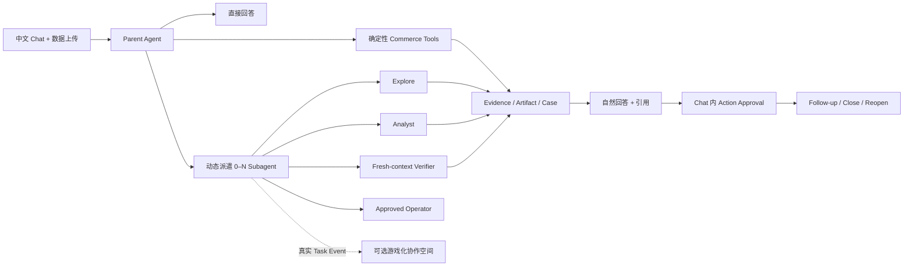

# Commerce Agent

> 工作名：面向电商经营人员的 Chat-first 异构数据诊断与行动 Agent。
>
> 2026-07-27 已完成 **Chat-first Commerce Agent + Parent 原生动态 Subagent Harness** 的面试交付：中文 DeerFlow Chat、真实六文件持久化 Thread/Run、Explore/Analyst 并行、fresh Verifier、Task/Event 驱动协作空间、SQLite 重启恢复、fresh DeepSeek V4 身份/Token/Request ID 审计及桌面/移动端浏览器 Gate 均已通过。旧 Case-first / 固定 Path 主链只读保留，作为历史能力、差异分析和迁移回退依据。

重定向 Phase 0–3 Release 已完成：Thread/Workspace/Dataset 隔离、11 个确定性 Commerce Tool、4 个 Commerce Skill、`spawn/wait/follow-up/cancel/resume` Durable 生命周期、动态 Skill/Tool 能力包、fresh-context Verifier、显式用户身份传播、`max_tool_rounds + max_tool_calls` 双预算和有界 Response Guard 均已落地。Fulfillment、Review、Capability Ablation、Peer 四条统一动态 Gate 已使用 fresh `deepseek-v4-flash` 全部通过；每条 15 个唯一请求、retry=0，且模型身份、Provider Request ID、Token 和 Stop Reason 全部进入 secret-free 审计。

[](./backend/pyproject.toml)
[](./Makefile)
[](./frontend/package.json)
[](./LICENSE)

## 当前状态

项目正在从旧 OpenSKU / EcomLaunch 方案改造为可真实使用、可审计、可持续跟进的 Commerce Agent。当前动态主链可以概括为：

```text
用户在 Thread 上传 CSV / JSON / JSONL / XLSX / ZIP
→ (user_id, thread_id) 映射隔离 Workspace 与 active Dataset
→ Parent 调用确定性 Commerce Tool 检查 Capability
→ 简单问题直接回答，复杂问题动态派遣 0–N 通用 Subagent
→ ContextPacket 冻结 Goal / Skill / Tool / Budget / SourceRefs
→ 独立任务并行执行，依赖任务按序等待
→ fresh-context Verifier 独立重算并抽查 Evidence
→ Parent 用中文自然综合，必要时升级 Case / Action / Follow-up
→ Trace 进入 Eval / Experiment / Skill Candidate / Shadow
```

新动态主线已经完成并有测试证据的部分包括：

- `(user_id, thread_id) → WorkspaceId → active DatasetId` 的确定性隔离，支持上传幂等、数据集选择、损坏状态 fail closed 和 CSV/JSON/JSONL/XLSX/ZIP；
- 11 个 Parent/Subagent 共用的确定性 Commerce Tool，覆盖接入、数据集、Profile、Capability、实体、窗口、同类、地域和 Evidence；
- `fulfillment-investigation`、`seller-peer-analysis`、`review-experience-diagnosis`、`commerce-diagnostic-synthesis` 四个动态 Skill；
- 通用 `explore / analyst / verifier / operator` Profile，不使用固定业务 Crew；Parent 每次派工只加载最小 Skill 和 Tool 白名单；
- Durable `spawn_task / wait_task / follow_up_task / cancel_task / resume_task`，包含 ContextPacket、Parent–Child lineage、append-only Event、Lease/Fencing 和恢复语义；
- Subagent Tool 双预算中间件：`max_tool_rounds` 限制循环轮次，`max_tool_calls` 限制单轮并行爆发和总调用数；预算耗尽后卸载 Tool 并强制基于已有证据综合，避免开放式 ReAct 漫游；
- Verifier 必须显式引用终态 `task:<task_id>`，Harness 注入只读 source snapshot，不继承 Parent 隐式历史；
- DeepSeek streaming Provider Request ID 修复、Gateway checkpointer Thread identity 修复、Subagent `user_id` 显式传播和 secret-free Token/Model/Stop telemetry；
- 四条动态 fresh Gate：上传 → ingest → capability → 同轮并行 Explore/Analyst → wait-all → fresh Verifier → 中文 Evidence 回答；最新统一运行 `4 passed in 253.05s`，单 Case 15 请求、179,430–190,004 Tokens，全部模型身份为 `deepseek-v4-flash`、Request ID 唯一、Parent Tool 错误为 0；最终回答只有在所有执行证据已通过时才允许一次无 Tool 的 fresh Response Guard 改写，改写仍重新执行完整确定性门禁。
- 持久化 Chat 浏览器 Gate v7：真实本地账号与 CSRF、六个公开 CSV、同一 Thread/Run 的 Parent–Subagent 执行和协作空间全部通过；Run 使用 170,394 Token，Lead 124,966、Subagent 45,428，13 个去重 Provider Request ID、retry 0，并在 Gateway 重启后恢复 3 个 Task、104 条 Run Event、15 条消息和最终中文答案。

此前 Case-first / 固定 Path 主链仍保留以下已验证能力，后续作为 Chat 内 Case、Evidence、Action 和高级详情的业务底座：

- 确定性 Data Intake、Profiler、Semantic Confirmation、Capability、Normalized Facts、Metric、Anomaly、Peer Cohort 和 Geographic Segment；
- Case、Lineage、append-only Evidence、versioned Hypothesis、Run、Checkpoint、Lease/Fencing 与权威 Domain Event Stream；
- `Fulfillment`、`SellerPeer`、`ReviewExperience` 三条 versioned DeerFlow Subagent Path，Capability 驱动的 0–3 Path 并行 fan-out、Evidence Barrier 与 fenced Committer；
- 持续 `CommerceLeadTurnService`，包括 persisted Observe、multi-Path synthesis、只读追问、bounded structured repair、WAIT/Resume/CANCEL、独立 Replan Run 与 fresh Verification Subagent；
- 四条 Gold Case 统一完整 Agent Investigation Release Gate：真实上传数据进入后，按期望执行 Fulfillment / ReviewExperience / SellerPeer Path，经过 Evidence Barrier、Lead、Fact/Metric-aware Fresh Verification、Run completion 与 Lease release；v11 使用 14 条唯一 fresh `deepseek-v4-flash` Agent 请求、全部 retry `0`，四个 scorecard 均可进入 release gate；
- Action/Approval HTTP 合同、服务端 Policy、真实内部 Artifact Connector、fenced Execution Run、失败释放、幂等重放和可验证 Rollback；
- Follow-up 对新数据重新计算 Signal，并在没有可靠对照时保持 `inconclusive`、禁止声称 Action 造成改善；
- Mapping Confirmation Resume、WAIT/Approval fencing Resume、Tool Failure 独立 Replan，以及 unknown-external-outcome reconciliation：旧 Task 不盲重试，未知远端结果会被持久化为 `path.blocked + post-checkpoint`，旧 Run 结束后才能显式创建新 Replan Run；
- Fresh DeepSeek V4 Action Planner：模型只能从固定内部 Action Catalog 选择，Risk、Policy、Approval、Connector、阈值和 Rollback 均由服务端确定；相同幂等 Key 重放不再调用模型；
- Semantic Evaluator、Experiment/Pareto Comparator、Holdout、Skill Candidate、Security Scan 与真实 Shadow。一次四 Case 实验通过旧门禁后，人工审计发现模型自造 `15% / 2×` Action 阈值，推动 `commerce-semantic-evaluator@1.3.0` 和确定性 `unsupported-action-threshold` 门禁；本轮真实 Holdout 还捕获并修复了 Semantic Evaluator 超长自由文本导致的 Schema 解析失败。当前有效 Candidate 为 `commerce-diagnostic-synthesis@1.3.0`：四条 Gold Case × 2 repetitions 的 Candidate `8/8`、零 hard-gate failure，并已通过两个真实 Shadow Run；Human Review / Promotion / Active Pointer / Rollback API 和故障恢复合同已经完成，但该真实 Candidate 仍停在 `shadow`，没有用户授权的人审就不会修改 Active Pointer。历史 `1.2.0` Candidate 保持不可变，不再作为当前晋级对象。

运行时选型已经固定为 **DeerFlow Harness + bounded Subagents + Commerce Domain**：DeerFlow 负责 Subagent、Tool、Skill、Streaming 和底层 LangGraph 执行；Commerce Run/Event/Checkpoint/Lease/Fencing 是业务权威状态，不从聊天文案推断 Case 状态。

真实模型配置使用官方 `https://api.deepseek.com/v1`、本地别名 `deepseek-reasoner`、Provider `deerflow.models.patched_deepseek:PatchedChatDeepSeek` 和 `max_retries=0`。2026-07-26 fresh Preflight 仍返回服务端身份 `deepseek-v4-flash`、HTTP 200、Provider Request ID、74 Total Tokens、`stop`、retry `0`；所有 Key 只存在于 Git 忽略的本地 `.env`，不会写入代码、文档或审计正文。

最新 Harness / Dynamic Release / Commerce Tool 聚焦回归为 `452 passed`，变更集 Ruff、前端 Prettier、ESLint 和 TypeScript 全部通过。前端为 `62 files / 334 tests`、6 条 Commerce Chat/协作空间 Playwright，Next.js production build 完成 `79/79` 静态页面。统一四 Gold fresh Gate 为 `4 passed in 253.05s`；独立 Response Guard smoke 也由真实 `deepseek-v4-flash` 完成，具备 Provider Request ID、Token 和 `stop` 证据。真实 Skill Evolution Holdout 为 Candidate `8/8`，32 个唯一模型请求，两个 Shadow Run 继续通过；本地 PostgreSQL 16 迁移、连接重启恢复和 fencing takeover 也已通过。历史固定 Path 的完整 Agent Gate 为 14 个唯一请求、71,478 Token；它用于迁移对照，不代替新动态主链门禁。详细过程见 [`docs/progress/2026-07-26-commerce-dynamic-release-hardening.md`](./docs/progress/2026-07-26-commerce-dynamic-release-hardening.md)、[`docs/progress/2026-07-26-commerce-dynamic-tool-skill-chain.md`](./docs/progress/2026-07-26-commerce-dynamic-tool-skill-chain.md) 和 [`docs/progress/2026-07-26-commerce-postgres-skill-evolution-release.md`](./docs/progress/2026-07-26-commerce-postgres-skill-evolution-release.md)。

要求级完成审计见 [`docs/progress/2026-07-26-commerce-phase7-completion-audit.md`](./docs/progress/2026-07-26-commerce-phase7-completion-audit.md)。它逐项记录已证明能力、真实调优过程和主动保留的生产边界；本轮面试交付已经完成，Skill Promotion 与外部 Connector 仍需用户授权，不能被当作自动完成项。

真实持久化浏览器 Release Gate 已通过：六文件上传、同一 Chat Thread/Run、Parent、Explore/Analyst、fresh Verifier、最终中文答案、协作空间、Drawer、桌面/390px/reduced-motion、模型身份、Provider Request ID、Token、retry 以及 Gateway 重启恢复均有直接证据。审计见 [`docs/progress/runs/2026-07-27-commerce-chat-browser-gate-v7/`](./docs/progress/runs/2026-07-27-commerce-chat-browser-gate-v7/)。此前隔离 Chat Dynamic v7 仍保留作为 Response Guard 的失败→根因→TDD→PASS 调优证据；它使用过一次受限改写，因此不能描述为 repair-free。中文求职材料包和基于原模板局部替换、原生渲染校验的单页 DOCX/PDF 已完成；内部 Artifact Connector 已通过真实可逆执行、读回和归档回滚门禁；本地 PostgreSQL 16 的完整迁移、连接重启恢复和 fencing takeover 也已通过。外部商家 Connector 继续 fail closed，Shadow Candidate 保持待人审。Master Shell、Case Detail v2、Data Inbox、Capability Report、Case Queue、Evidence Explorer、Action Center、Agent Run 与 Skills & Evals 作为 Chat 详情、Drawer 或高级页面复用，不再作为默认产品入口。

Phase 4A 已冻结 Task Event → Visual State 合同并接入 authenticated Durable Task/Event API：Chat 紧凑任务状态和协作空间共用同一纯 ViewModel，未知/乱序/重复 Event 显式处理，不从聊天文本或计时器推断活动。增量 Hook 按每个 Task 的 `next_after_seq` 串行轮询，游标只前进、重复序号不重放，并在 Run 切换或组件卸载时取消请求。`failed`、`cancelled` 和 `timed_out` 保持独立终态，Lease 释放不会把失败、取消、超时、阻塞或等待错误标成 idle；延迟到达的 Tool、Message 或 Lease Event 只能补充脱敏审计摘要，不能让非 working Actor 重新显示为忙碌。renderer-neutral Collaboration Scene ViewModel、DeerFlow Chat 紧凑任务状态和可选游戏化协作空间均已实现：一个唯一 `task_id` 最多产生一个原创角色精灵和一个生成工位，没有 Task 时只显示空房间，不生成固定 Crew 或假忙碌。内置 `commerce-agent` 已固定使用 `deepseek-reasoner` 别名、`commerce` Tool 组、四个 Commerce Skill 和强制 Durable Subagent Harness；客户端即使选择非 Ultra 模式也不能关闭其 Subagent 能力。11 个 Commerce Tool 默认不会泄漏给普通 DeerFlow Agent，并同时受 `COMMERCE_CASE_AGENT_ENABLED` 环境开关保护；Gateway 在创建 Run 前也会拒绝关闭状态下的 Commerce Agent。原创角色、空场景和工位的完整 Prompt、去底参数、SHA-256 和机械浏览器截图见 [`docs/design/commerce-collaboration-imagegen-assets-v1.md`](./docs/design/commerce-collaboration-imagegen-assets-v1.md)。当前前端单元门禁为 `62 files / 334 tests`，Prettier、ESLint、TypeScript、6 条 Commerce Chat/协作空间 Chromium 机械交互和真实持久化 DeepSeek V4 浏览器 Gate 均通过。

完整设计与实施计划：

- [`docs/plans/2026-07-24-commerce-chat-subagent-harness-plan.md`](./docs/plans/2026-07-24-commerce-chat-subagent-harness-plan.md)
- [`docs/adr/0006-commerce-agent-is-chat-first-with-dynamic-subagents.md`](./docs/adr/0006-commerce-agent-is-chat-first-with-dynamic-subagents.md)
- [`docs/plans/2026-07-18-commerce-case-agent-complete-design-and-implementation-plan.md`](./docs/plans/2026-07-18-commerce-case-agent-complete-design-and-implementation-plan.md)
- [`docs/adr/0005-commerce-uses-deerflow-subagent-runtime.md`](./docs/adr/0005-commerce-uses-deerflow-subagent-runtime.md)
- [`docs/portfolio/commerce-case-agent-architecture.md`](./docs/portfolio/commerce-case-agent-architecture.md)
- [`docs/portfolio/commerce-case-agent-demo-script.md`](./docs/portfolio/commerce-case-agent-demo-script.md)
- [`docs/portfolio/commerce-case-agent-interview-guide.md`](./docs/portfolio/commerce-case-agent-interview-guide.md)

Phase 0 基线与迁移清单：

- [`docs/migration/commerce-case-agent-phase0-baseline.md`](./docs/migration/commerce-case-agent-phase0-baseline.md)

真实模型门禁记录：

- [`docs/progress/2026-07-18-commerce-real-deepseek-v4-preflight.md`](./docs/progress/2026-07-18-commerce-real-deepseek-v4-preflight.md)
- [`docs/progress/2026-07-18-commerce-phase2-peer-geographic-metrics.md`](./docs/progress/2026-07-18-commerce-phase2-peer-geographic-metrics.md)
- [`docs/progress/2026-07-18-commerce-phase3-case-event-persistence.md`](./docs/progress/2026-07-18-commerce-phase3-case-event-persistence.md)
- [`docs/progress/2026-07-18-commerce-phase3-evidence-hypothesis-persistence.md`](./docs/progress/2026-07-18-commerce-phase3-evidence-hypothesis-persistence.md)
- [`docs/progress/2026-07-18-commerce-phase3-api-read-slice.md`](./docs/progress/2026-07-18-commerce-phase3-api-read-slice.md)
- [`docs/progress/2026-07-18-commerce-phase3-anomaly-to-case.md`](./docs/progress/2026-07-18-commerce-phase3-anomaly-to-case.md)
- [`docs/progress/2026-07-18-commerce-semantic-candidate-real-deepseek-v4.md`](./docs/progress/2026-07-18-commerce-semantic-candidate-real-deepseek-v4.md)
- [`docs/progress/2026-07-18-commerce-phase4-context-router-budget.md`](./docs/progress/2026-07-18-commerce-phase4-context-router-budget.md)
- [`docs/progress/2026-07-19-commerce-phase4-model-loop-path-result.md`](./docs/progress/2026-07-19-commerce-phase4-model-loop-path-result.md)
- [`docs/progress/2026-07-19-commerce-investigation-run-persistence-api.md`](./docs/progress/2026-07-19-commerce-investigation-run-persistence-api.md)
- [`docs/progress/2026-07-19-commerce-run-lease-harness-boundary.md`](./docs/progress/2026-07-19-commerce-run-lease-harness-boundary.md)
- [`docs/progress/2026-07-19-commerce-case-data-lineage.md`](./docs/progress/2026-07-19-commerce-case-data-lineage.md)
- [`docs/progress/2026-07-19-commerce-initial-context-loader.md`](./docs/progress/2026-07-19-commerce-initial-context-loader.md)
- [`docs/progress/2026-07-19-commerce-fulfillment-path-real-deepseek-v4.md`](./docs/progress/2026-07-19-commerce-fulfillment-path-real-deepseek-v4.md)
- [`docs/progress/2026-07-19-commerce-fenced-worker-real-path-step.md`](./docs/progress/2026-07-19-commerce-fenced-worker-real-path-step.md)
- [`docs/progress/2026-07-19-commerce-restart-resume-classifier.md`](./docs/progress/2026-07-19-commerce-restart-resume-classifier.md)
- [`docs/progress/2026-07-19-commerce-fresh-context-verification.md`](./docs/progress/2026-07-19-commerce-fresh-context-verification.md)
- [`docs/progress/2026-07-19-commerce-lead-synthesis-real-deepseek-v4.md`](./docs/progress/2026-07-19-commerce-lead-synthesis-real-deepseek-v4.md)
- [`docs/progress/2026-07-19-commerce-worker-lead-verification-loop.md`](./docs/progress/2026-07-19-commerce-worker-lead-verification-loop.md)
- [`docs/progress/2026-07-19-commerce-seller-peer-path-real-deepseek-v4.md`](./docs/progress/2026-07-19-commerce-seller-peer-path-real-deepseek-v4.md)
- [`docs/progress/2026-07-19-commerce-action-api.md`](./docs/progress/2026-07-19-commerce-action-api.md)
- [`docs/progress/2026-07-19-commerce-action-execution-rollback.md`](./docs/progress/2026-07-19-commerce-action-execution-rollback.md)
- [`docs/progress/2026-07-19-commerce-follow-up-loop.md`](./docs/progress/2026-07-19-commerce-follow-up-loop.md)
- [`docs/progress/2026-07-19-commerce-eval-experiment-skill-evolution.md`](./docs/progress/2026-07-19-commerce-eval-experiment-skill-evolution.md)
- [`docs/progress/2026-07-19-commerce-action-planner.md`](./docs/progress/2026-07-19-commerce-action-planner.md)
- [`docs/progress/2026-07-19-commerce-skill-shadow.md`](./docs/progress/2026-07-19-commerce-skill-shadow.md)
- [`docs/progress/2026-07-19-commerce-four-gold-threshold-tuning-skill-v1.3.md`](./docs/progress/2026-07-19-commerce-four-gold-threshold-tuning-skill-v1.3.md)
- [`docs/progress/2026-07-26-commerce-dynamic-release-hardening.md`](./docs/progress/2026-07-26-commerce-dynamic-release-hardening.md)

## 解决什么问题

电商运营人员通常不是来要一份泛泛的“优化方案”，而是已经感觉经营出了问题：履约变慢、评分下降、低分评价上升、某类卖家表现异常，或者不同报表之间互相矛盾。

他们真正需要连续回答四个问题：

```text
哪里出了问题？
为什么发生？
现在最值得做什么？
做完以后有没有改善？
```

Commerce Agent 让用户从自然对话开始，并在任务需要长期调查、行动或 Follow-up 时，自动升级为可审计、可恢复的 `Case`：

```text
上传 CSV / Excel / 数据目录并自然提问
→ 识别字段、实体、时间和可用能力
→ Parent 直接回答 / 调用确定性 Tool / 动态派遣 0–N Subagent
→ 复杂任务升级为 Case
→ 持久化 Evidence 与任务状态
→ 独立验证结论
→ Chat 内生成可审批 Action
→ 新数据到来后 Follow-up
→ Close / Reopen / Inconclusive / Blocked
```

## 用户如何使用

首要交互是上传真实数据，而不是要求用户先学会写复杂 Prompt。

用户可以：

- 拖入一个或多个 CSV / Excel 文件；
- 上传一个包含多张表的数据目录或压缩包；
- 说明“最近评分突然下降，帮我找到原因”；
- 在同一对话中持续追问，不强制每次重新运行完整流程；
- 展开查看 Subagent、Evidence、Artifact 和模型运行详情；
- 在 Chat 中批准、拒绝或修改受控 Action；
- 让系统在新数据到来时重新检查已有任务；
- 点击“查看协作空间”，观察真实任务事件驱动的游戏化 Subagent 场景。

当上传数据缺少曝光、点击、加购、广告消耗、库存或利润时，系统不会假装拥有这些字段。它会完成当前数据允许的诊断，明确 `unknown`，并给出精确补数建议。

## 首批聚焦范围

首批保留三条已经打穿的业务能力，并逐步迁移为 Skill、Tool 和 Gold Case：

| 已验证能力 | 关注问题 | 目标形态 |
|---|---|---|
| 履约与承运调查 | 延迟来自卖家处理还是承运运输 | Commerce Skill + Metric Tool + Gold Case |
| 卖家或实体对标 | 某卖家或实体是否偏离同类基线 | Commerce Skill + Segment Tool + Gold Case |
| 评价体验诊断 | 评分下降是否与商品体验问题有关 | Commerce Skill + Text/Evidence Tool + Gold Case |

Parent 使用通用 `explore`、`analyst`、`verifier`、`operator` Profile，根据问题、数据 Capability 和历史 Evidence 动态启动 0–N 个任务，不使用固定 Crew。

本轮不做：

- 万能电商经营平台；
- 模拟市场或虚构经营效果；
- 广告投放、库存、利润、定价、内容生成等全场景覆盖；
- 只输出报告、文案或“7 天方案”的一次性系统；
- 无人工门禁的高风险写操作；
- 线上 Agent 直接修改 Active Skill。

## 核心架构



### Harness 与业务边界

项目建立在 ByteDance DeerFlow 的开源 Harness 之上。

保留并复用的通用能力包括：

- LangGraph Runtime 与 RunManager；
- Streaming、Checkpoint、Sandbox 和 Tool 系统；
- Upload、Artifact、Auth、Memory 和 Skills 基础设施；
- Token Tracking、Loop Detection 和通用中间件。

个人新增主线位于应用层：

- `backend/app/commerce/`：Commerce Domain、数据、Metric、Case、Agent、Repository 与 API；
- Commerce Domain Event 与 Case 生命周期；
- Capability-driven Path Routing；
- Fresh-context Verification；
- Action / Approval / Follow-up；
- DeepSeek V4 真实模型评测 Harness；
- 受控 Skill Evolution；
- Codex-inspired Commerce Workspace。

依赖方向：

```text
app.* → deerflow.*
deerflow.* -X→ app.*
```

## 四条 Gold Case

系统首先用 Olist 公开电商数据构建四条可复现 Gold Case：

1. 履约异常：延迟与评分同时恶化，但卖家处理时长没有恶化，主要异常在承运运输阶段；必须反驳“卖家出库不足”。
2. 评价体验异常：延迟率为 0，但评分和低分率恶化，评论出现疑似非原装、错发、少发；不得确认售假或欺诈。
3. 能力缺失：删除 Review 数据后仍完成履约诊断，但不得声称评分下降；必须跳过 Review Path 并给出精确补数建议。
4. 卖家对标异常：目标卖家在同时间、同商品类目、同卖家州的结果无关 Cohort 中，延迟率为 `16/59 = 27.12%`；5 个 Peer 合计为 `19/257 = 7.39%`。差距支持继续调查，但不能直接证明卖家自身导致延迟。

完整公开数据不进入 Git。仓库只保存来源、Schema、构建脚本和经过审查的小型 Fixture。

当前四条 Fixture 位于 [`evals/commerce/cases/`](./evals/commerce/cases/)，构建与边界说明见 [`evals/commerce/README.md`](./evals/commerce/README.md)。

## Loop、Harness 与进化

每个调查 Loop 都必须具备：

- 明确 Goal；
- 可消费 Budget；
- 最小 ContextPacket；
- 结构化 Evidence；
- Checkpoint；
- Stop Condition；
- Verification；
- 可观察 Trace。

Skill 不在线自改。进化流程：

```text
Skill Candidate
→ Offline Eval
→ Regression
→ Holdout
→ Human Review
→ Shadow
→ Active / Rollback
```

## 真实 DeepSeek V4 测试政策

纯确定性测试保持无模型，例如 Domain、Metric、State Transition、Repository、Event、Budget、Policy 和数据质量。

任何触达 LLM 或验证 Agent 行为的测试，都必须向真实 DeepSeek V4 发起当次新请求，包括 Parent、Subagent、Router 模型判断、Tool Selection、Verification、Semantic Evaluator、Skill Candidate、Agent Integration、Gold Case E2E、Experiment 和 Release Gate。

禁止用以下方式作为通过证据：

- Mock / Fake / Stub ChatModel；
- 录制回放或缓存响应；
- 其他 DeepSeek 版本；
- 其他厂商模型；
- 历史 Trace。

当前本地别名 `deepseek-reasoner` 不能单独证明服务端是 DeepSeek V4。Agent 测试前必须通过 `backend/app/commerce/evaluation/real_model_preflight.py`，确认实际模型身份并记录 Provider Request ID、Token、Latency、Retry 和配置版本。预检为每次请求注入唯一 nonce，显式关闭 LangChain 响应缓存与 SDK 自动重试，不保存 Prompt 或响应正文，只保存 nonce / 响应内容 SHA-256 与审计元数据；每次结果以不可覆盖 JSON 写入 `.deer-flow/commerce/evaluation/real-model-preflight/`。

如果模型不可用、身份无法确认、鉴权失败或额度不足，测试必须停止并报告 `blocked`，不能静默 Skip 或切换模型。

## Feature Flag

新系统默认关闭：

```bash
COMMERCE_CASE_AGENT_ENABLED=false
NEXT_PUBLIC_COMMERCE_CASE_AGENT_ENABLED=false
NEXT_PUBLIC_COMMERCE_WORKSPACE_ID=wsp_<32 lowercase hex chars>
```

后端 Flag 控制 Commerce Router 是否挂载；前端 Flag 控制 Commerce Workspace 入口和 `/commerce` 路由是否显示。两个 Flag 都开启，并显式配置合法 Workspace ID 后，新系统入口才完整可用。前端不会猜测 Workspace，也不会在缺少上下文时跨 Workspace 读取 Case。

旧 OpenSKU / EcomLaunch 不会自动接入新系统。

## 前端方向

目标前端采用 Chat-first、Codex-inspired Workspace：

- 左侧只保留新建任务和历史对话；
- 中央是中文自然对话、文件上传和持续追问；
- Subagent、Evidence、Artifact 和 Action Approval 在 Chat 中紧凑呈现并按需展开；
- 高级 Run、模型遥测、Skill 与 Eval 进入详情或开发者入口；
- 点击“查看协作空间”后，中央切换为原创游戏小人构成的微缩工作场景；
- 固定 War Room 不再作为默认页面。

Chat、任务详情和游戏化协作空间读取同一个 Task / Domain Event Stream。场景不播放预设忙碌动画；没有真实事件时显示等待、空闲或阻塞。

Chat 主界面和游戏化协作空间必须先生成高保真视觉稿并完成选择，再实现 React / Canvas。游戏资产在任务状态合同冻结后使用图像生成制作。

已完成的中文 Case-first Master Shell 与 Case Detail v2 保留为迁移素材和高级详情实现，当前位于：

```text
frontend/src/app/commerce/
frontend/src/components/commerce/master-shell.tsx
frontend/src/core/commerce/
```

当前页面支持真实 Commerce Read API、Case 切换、Domain Event 排序与中文投影、未知事件显式降级、Evidence / Run 视图、子智能体与 Runtime 状态、空状态、错误状态、窄屏侧滑导航和对象级检查面板。Case Detail v2 的默认概览只回答“发生了什么、当前判断、证据边界、下一步”；确定性 Analysis Artifact 和 Action Summary 来自后端读模型，不由前端硬编码。Data Inbox 支持 Workspace-scoped Dataset List/Detail、只读来源与 SHA-256 校验、multipart 上传、Dataset-scoped 语义确认和“未观察”字段边界。Capability Report 读取同一 Dataset Detail、Capability Profile 与 Semantic Mapping Profile，明确投影“可直接分析 / 部分可分析 / 当前不可分析”。Case Queue 读取真实 Case List，按状态和风险分组、筛选与搜索；可用能力路径会预选进入 Explicit Case 表单，补齐数据批次、经营主体和两个分析窗口后调用真实创建合同，同一内容重复提交返回同一 Case。Evidence Explorer 将支持、矛盾和未知证据同级展示，恢复 Metric 窗口与 Hypothesis 关系；Fact 详情尚未开放时只展示审计编号，不伪造事实正文。Action Center 从严格 Action Record 投影参数、策略、审批、执行工具和回滚方案，支持批准、拒绝、稳定幂等执行和可验证回滚；外部商家写操作仍由后端 Policy fail closed。顶层“运行记录”读取严格 Run Detail、Domain Event 与 Goal Loop Checkpoint 合同，展示同级 Path fan-out、可审计证据屏障、主智能体综合、新鲜上下文验证、模型请求遥测、预算和恢复检查点；缺失遥测保持“未观察”，不从动画或聊天推断运行状态。“技能与评测”读取不可变 Candidate、绑定的 Experiment Definition/Report 和可选 Active Pointer，展示 hard gate、Control/Candidate Pareto、Shadow Run ID、人工审查、激活与回滚；Shadow 请求遥测未开放时不从 Run 数量推断请求数量，运行中智能体也不能修改 Active Pointer。无异常信号的用户请求显示为“用户发起的履约诊断”等诊断标题，不伪造“异常”。Metric Window 可以保留上传数据中的严格 source-local datetime，Event/Run/审计时间仍要求 offset。Case Composer 只在概览页显示；案例问答等尚未接线的入口会诚实提示“未发送”，不会伪造 Agent 运行。

实现截图：

- `docs/design/commerce/implementation/master-shell-react-desktop-v1.png`；
- `docs/design/commerce/implementation/master-shell-react-mobile-v1.png`。
- `docs/design/commerce/implementation/case-detail-react-desktop-v1.png`；
- `docs/design/commerce/implementation/case-detail-react-evidence-inspector-v1.png`；
- `docs/design/commerce/implementation/case-detail-react-mobile-v1.png`；
- `docs/design/commerce/implementation/data-inbox-react-empty-v1.png`；
- `docs/design/commerce/implementation/data-inbox-react-review-v1.png`；
- `docs/design/commerce/implementation/capability-report-react-desktop-v1.png`；
- `docs/design/commerce/implementation/capability-report-react-mobile-v1.png`；
- `docs/design/commerce/implementation/case-queue-react-desktop-v1.png`；
- `docs/design/commerce/implementation/case-queue-react-mobile-v1.png`；
- `docs/design/commerce/implementation/case-queue-react-create-v1.png`。
- `docs/design/commerce/implementation/evidence-explorer-react-desktop-v1.png`；
- `docs/design/commerce/implementation/evidence-explorer-react-mobile-v1.png`。
- `docs/design/commerce/implementation/action-center-react-desktop-v1.png`；
- `docs/design/commerce/implementation/action-center-react-mobile-v1.png`。
- `docs/design/commerce/implementation/agent-run-react-desktop-v1.png`；
- `docs/design/commerce/implementation/agent-run-react-mobile-v1.png`。
- `docs/design/commerce/implementation/skills-evals-react-desktop-v1.png`；
- `docs/design/commerce/implementation/skills-evals-react-mobile-v1.png`。

Case Detail 已额外通过真实本地注册/登录、Commerce 独立迁移、冻结 Olist `GC-FULFILLMENT-001` Data Intake / Analyze 和真实浏览器读取：生成 1 个 Case、5 个确定性异常信号和 5 条 Evidence，页面展示 `3.5% → 35.1%` 并保留“尚未完成独立验证 / 尚无候选行动”。结构化 mock API Playwright 仍只验证 UI 机械行为；真实 Olist 验收验证确定性数据与读取链路，但本次没有启动 Agent Run，不能作为 DeepSeek V4 Agent Release Gate。

## Legacy

以下目录只读保留，作为旧项目成果、历史评测和失败经验：

- `agents/ecom-launch/`；
- `skills/custom/ecom-launch/`；
- `evals/opensku/`；
- `scripts/opensku/`；
- `docs/ecom-launch/`；
- `docs/knowledge/opensku/`；
- `frontend/src/components/workspace/ecom-launch/`。

它们不是 Commerce Case Agent 的当前验收或 Release Gate。保护快照位于：

```text
archive/ecom-launch-pre-commerce-agent-20260718
9144237
```

## 开发

### 环境

- Python 3.12+
- Node.js 22+
- pnpm 10.26.2+
- uv
- 可选：Docker

### 启动 DeerFlow 基础设施

```bash
make install
make config
make dev
```

默认统一入口：

```text
http://localhost:2026
```

### 确定性验证

```bash
cd backend
PYTHONPATH=. uv run pytest tests/commerce \
  --ignore=tests/commerce/evaluation/test_real_model_preflight_live.py \
  --ignore=tests/commerce/data/test_semantic_candidate_service_live.py \
  --ignore=tests/commerce/agents/test_fulfillment_path_agent_live.py \
  --ignore=tests/commerce/agents/test_worker_fulfillment_step_live.py \
  --ignore=tests/commerce/agents/test_verification_live.py \
  --ignore=tests/commerce/agents/test_lead_synthesis_live.py \
  --ignore=tests/commerce/agents/test_worker_lead_verification_loop_live.py \
  --ignore=tests/commerce/agents/test_seller_peer_path_agent_live.py \
  --ignore=tests/commerce/agents/test_review_experience_path_agent_live.py \
  --ignore=tests/commerce/agents/test_fulfillment_subagent_live.py \
  --ignore=tests/commerce/agents/test_fulfillment_subagent_parity_live.py \
  --ignore=tests/commerce/agents/test_fulfillment_subagent_supervisor_live.py \
  --ignore=tests/commerce/agents/test_seller_peer_subagent_live.py \
  --ignore=tests/commerce/agents/test_review_experience_subagent_live.py -v

cd ../frontend
pnpm typecheck
pnpm lint
```

### 真实模型验证

真实模型测试不会因为缺少密钥、额度或网络而静默跳过；预检会持久化明确的 `blocked_*` 状态并使测试失败。统一入口是：

```bash
cd backend
PYTHONPATH=. uv run pytest -m real_model tests/commerce -v
```

截至 2026-07-20，四条 Gold Case 已通过统一完整 Agent Investigation Gate。`GC-FULFILLMENT-001` 执行 Fulfillment + ReviewExperience，`GC-REVIEW-002` 只执行 ReviewExperience，`GC-CAPABILITY-003` 只执行 Fulfillment，`GC-PEER-004` 执行 Fulfillment + SellerPeer；每个 Case 的实际 Paths 与预期一致，所有选中 Path completed，Fresh Verification pass，Run 以 `goal_achieved` completed，Lease 最终释放。v11 共持久化 14 个唯一 Agent Provider Request ID、`71,478` Agent Tokens、约 `85.68s` 累计 Agent Latency，全部服务端身份为 `deepseek-v4-flash`、retry `0`。v1–v10 的真实失败没有删除，包括 Review schema/JSON/引用、Verification Fact 合同与输出预算、显式 Fulfillment 无 Anomaly、以及模型客户端生命周期问题；完整演进见 [`docs/progress/2026-07-20-commerce-four-gold-agent-release.md`](./docs/progress/2026-07-20-commerce-four-gold-agent-release.md)。该门禁只证明 Investigation，不声称四个 Run 内执行了 Action/Approval/Follow-up。

### Commerce 数据库迁移

Commerce 使用独立 Alembic 入口和独立版本表 `commerce_alembic_version`，不会把应用迁移混入 DeerFlow Harness 的迁移历史：

```bash
cd backend
PYTHONPATH=. .venv/bin/python -m app.commerce.persistence.migrations \
  upgrade --url "sqlite+aiosqlite:////absolute/path/to/deerflow.db"
```

运行时仍复用 DeerFlow 已初始化的异步 Engine / Session Factory；独立的是 Commerce ORM Metadata、表前缀和迁移分支，不是另开一套数据库连接池。

### Commerce API

Commerce API 默认关闭。只有设置 `COMMERCE_CASE_AGENT_ENABLED=true` 后，Gateway 才挂载 `/api/commerce` 路由。当前已实现的确定性数据与读取合同是：

- `POST /api/commerce/datasets/intake`：多文件上传、只读存储、Hash/Manifest、Profile、Semantic Mapping 和 Capability 一次返回；
- `GET /api/commerce/datasets/{dataset_id}/profile`：从不可变 Manifest 重算 Dataset Profile；
- `GET /api/commerce/datasets/{dataset_id}/capabilities`：从 Profile 和当前 Workspace confirmations 重算 Capability；
- `GET /api/commerce/datasets/{dataset_id}/mappings` 与 `POST /api/commerce/datasets/{dataset_id}/semantic-confirmations`：读取并持久化显式字段语义确认；
- `POST /api/commerce/datasets/{dataset_id}/semantic-candidates`：在真实 DeepSeek V4 门禁后生成 LLM 候选；候选只能进入 `needs_confirmation`，不会直接改变 confirmed 语义；
- `POST /api/commerce/datasets/{dataset_id}/analyze`：按时间窗口确定性计算 Metric、检测 Anomaly、创建可 Replay 的 Case/Evidence/Event 闭环；
- `GET /api/commerce/cases`：Workspace-scoped Case 列表和状态过滤；
- `GET /api/commerce/cases/{case_id}`：Case、最新 Evidence 和 Hypothesis；
- `GET /api/commerce/cases/{case_id}/evidence` 与 `/evidence/{evidence_id}`；
- `GET /api/commerce/cases/{case_id}/hypotheses`：每个 Hypothesis 的最新版本；
- `GET /api/commerce/cases/{case_id}/events`：按 Case Sequence 排序的 Domain Event Stream。

读取请求必须携带 `X-Commerce-Workspace-Id`。该 header 是当前阶段的显式 Workspace 边界合同；正式接入用户 Workspace membership 之前，不应将 Commerce feature flag 在多租户生产环境中打开。没有持久化数据、权限映射或事件时，API 返回空、404 或明确的 503，不从自然语言或前端状态推断 Case。

## 归属声明

ByteDance DeerFlow 提供通用 Agent Harness 与全栈基础设施。本项目的面试重点不是把 DeerFlow 现有能力包装成原创，而是展示在其上完成的电商 Case 产品定义、业务 Domain、数据工程、Agent Loop、Context、Verification、Eval、受控进化和真实前端闭环。
