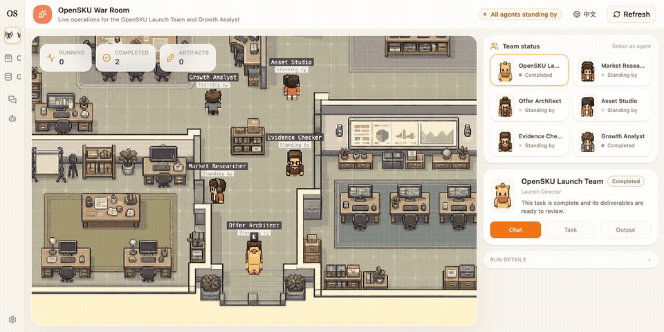
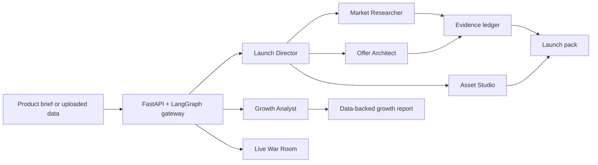

<p align="center">
  
</p>

<h1 align="center">OpenSKU</h1>

<p align="center"><strong>The open-source AI launch team for ecommerce.</strong></p>

<p align="center">
  Turn a product idea into an evidence-backed go/no-go decision, offer strategy,<br />
  and launch-ready assets.
</p>

<p align="center">
  <a href="https://github.com/CheungkiCheung/opensku/actions/workflows/backend-unit-tests.yml"></a>
  <a href="https://github.com/CheungkiCheung/opensku/actions/workflows/frontend-unit-tests.yml"></a>
  <a href="LICENSE"></a>
  <a href="https://github.com/CheungkiCheung/opensku/stargazers"></a>
  <a href="https://github.com/CheungkiCheung/opensku/issues"></a>
</p>

<p align="center">
  <a href="#try-the-bilingual-demo"><strong>Try demo</strong></a> ·
  <a href="#quick-start">Quick start</a> ·
  <a href="#what-opensku-delivers">What it delivers</a> ·
  <a href="#how-it-works">How it works</a> ·
  <a href="docs/war-room.md">War Room</a> ·
  <a href="README_CN.md">简体中文</a>
</p>



OpenSKU gives solo founders, product teams, and ecommerce operators a coordinated AI team for the work that happens before inventory, ad spend, and launch commitments. It researches public market signals, separates evidence from assumptions, designs an offer, and produces an editable launch pack in one auditable workflow.

## Try the bilingual demo

The recorded demo supports English and Chinese without a backend, model provider, or API key. It uses deterministic sample data, clearly labels that no live agents are running, and includes a 60-second guided walkthrough across two scenarios: Launch Validation and a Growth Analyst experiment. The Launch path exposes a bounded agent-environment loop—action, structured observation, dynamically selected minimal repair, recheck, and stop condition—while each scenario includes a warm War Room replay and four inspectable deliverables in the selected language.

```bash
cd frontend
pnpm install
pnpm demo
```

Open the [English demo](http://localhost:3000/demo?lang=en) or [Chinese demo](http://localhost:3000/demo?lang=zh). Start with the hypothetical compact travel coffee mug, then switch to the recorded checkout experiment to inspect a read-only multi-file analysis, two-proportion test, SRM check, cohort fixture, and bounded memory snapshot. Scenario and language choices are preserved in the URL, and both paths are explicitly separated from live research and real store data.

## What OpenSKU delivers

| You bring | OpenSKU investigates | You receive |
| --- | --- | --- |
| A rough product idea, public link, or short brief | Market signals, competitors, pricing, customer language, risks, and missing evidence | A go / validate / stop recommendation with explicit confidence and next steps |
| Optional CSV or XLSX data | Changes, anomalies, segments, cohorts, and experiment results | A growth analysis grounded in the uploaded data |
| Brand constraints and target channel | Positioning, offer hypotheses, listing structure, hooks, and scripts | Editable launch assets instead of a chat-only answer |

### One brief in → a launch pack out

```text
product brief
  ├─ market and voice-of-customer research
  ├─ competitor and price scan
  ├─ evidence ledger with source boundaries
  ├─ positioning and offer hypotheses
  ├─ listing copy and content hooks
  └─ seven-day validation plan
```

The full launch workflow can produce:

```text
launch-war-room.html
evidence-ledger.json
competitor-table.csv
positioning-brief.md
listing-pack.md
content-pack.md
launch-calendar.csv
```

## Meet the launch team

| Runtime role                              | Responsibility                                                                                             |
| ----------------------------------------- | ---------------------------------------------------------------------------------------------------------- |
| **Launch Director**                       | Breaks down the brief, coordinates specialists, and assembles the decision pack.                           |
| **Market Researcher**                     | Finds competitors, pricing signals, market context, and real customer language.                            |
| **Offer Architect**                       | Builds positioning, offer, pricing, and low-cost validation hypotheses.                                    |
| **Asset Studio**                          | Turns the strategy into listing copy, content angles, and launch-ready scripts.                            |
| **Growth Analyst**                        | Analyzes uploaded CSV/XLSX data for changes, anomalies, cohorts, and experiments.                          |
| **Deterministic Preflight (system gate)** | Checks the seven-file contract, evidence URLs, JSON/CSV structure, and unsupported claims before delivery. |

The War Room is not a fake animation layer. It visualizes the latest real thread, run, task, artifact, and failure state for each agent. Its replay dock can switch between persisted Launch Team and Growth Analyst runs, reconstructing their actual handoffs, tool observations, verification or experiment steps, decisions, and terminal state without inventing agent activity. The interface supports both English and Chinese, including the Phaser scene labels and interaction menu.

The interview demo separates the fixed specialist workflow from the adaptive delivery loop: the first `present_files` call receives two structured preflight violations, the lead agent selects only the affected 2/7 files and bounded edit tools, the second call passes 7/7, and the run stops after using 2/5 available iterations.

## Choose the right mode

| Mode | Best for | Behavior |
| --- | --- | --- |
| **Flash** | Fast product questions and early category scans | One agent researches and answers directly. |
| **Ultra** | Full pre-launch validation | The Launch Director coordinates specialist work and produces the complete pack. |
| **Growth Analyst** | Store, campaign, or content-performance data | Uses uploaded CSV/XLSX files and deterministic analysis tools. |

## Evidence before confidence

OpenSKU keeps claims auditable with three evidence classes:

- `observed_public` — directly supported by a public source;
- `estimated` — calculated or inferred from visible evidence;
- `assumption` — an explicit hypothesis that still needs validation.

That contract prevents an attractive report from quietly turning missing data into invented certainty. Run budgets also bound LLM calls, token use, and execution time.

## Quick start

### Prerequisites

- Python 3.12+
- Node.js 22+
- [uv](https://docs.astral.sh/uv/)
- pnpm 10+
- nginx for the unified local endpoint, or Docker Desktop for container-based development

### Install and run

```bash
git clone https://github.com/CheungkiCheung/opensku.git
cd opensku
make quickstart
```

`make quickstart` opens the interactive configuration wizard, installs backend and frontend dependencies, and starts the development services. Open [http://localhost:2026](http://localhost:2026) when startup completes.

If you prefer to run each step separately:

```bash
make setup
make install
make dev
```

The setup wizard creates the local configuration files. Add at least one supported model-provider API key when prompted. Secrets, local databases, and generated runtime state should remain uncommitted.

### Docker development

```bash
make docker-init
make docker-start
```

Then open [http://localhost:2026](http://localhost:2026). See [CONTRIBUTING.md](CONTRIBUTING.md) for local, Docker, test, and troubleshooting details.

## How it works



| Layer | Technology |
| --- | --- |
| Agent runtime | Python, FastAPI, LangGraph, LangChain |
| Product interface | Next.js, React, TypeScript, Tailwind CSS |
| War Room | Phaser with original room and character assets |
| Data analysis | Deterministic CSV/XLSX inspection plus read-only analytical tools |
| Local storage | SQLite checkpoints and application data |

## Development

```bash
# Backend
cd backend
make test
make lint

# Frontend
cd frontend
pnpm typecheck
pnpm test
pnpm test:e2e
```

Backend unit tests do not require model-provider credentials. Running model-backed application flows still requires at least one configured provider key.

### Reproducible product verification

OpenSKU includes two deterministic full-stack replay scenarios. The browser talks to a real production Next.js build and a real Gateway/runtime; only the LLM is replaced by a committed, input-hash-matched fixture.

```bash
# Mock UI E2E on an isolated port (3101 by default)
cd frontend
pnpm test:e2e

# Launch Ultra + Growth Analyst full-stack replay
pnpm test:e2e:opensku-replay

# Evidence-gated Launch + Growth contract benchmark (3 repeats)
cd ..
make benchmark-replay

# Focused landing/demo/War Room visual regression
cd frontend
pnpm test:e2e:visual

# Rebuild the replay fixture after intentional prompt/tool changes
cd ../backend
PYTHONPATH=. uv run python scripts/build_opensku_replay_fixture.py
```

The Launch replay verifies the three-specialist dependency chain, a seven-file pack, deterministic preflight feedback, minimal repair, re-validation, and War Room checkpoint hydration. The Growth replay uploads three CSV files through the real API and verifies inspection, multi-file join, two-proportion significance analysis, and the final ship/extend/stop decision.

`make benchmark-replay` drives those same real Gateway paths with the committed deterministic replay provider and writes sanitized JSON, Markdown, and HTML reports to `benchmarks/opensku-replay/`. The report verifies contract completion and deterministic numeric checks. Replay wall-clock timing is retained only as a harness diagnostic and is never eligible for a product-performance claim.

The current published contract baseline is available as [JSON](benchmarks/opensku-replay/latest-summary.json), [Markdown](benchmarks/opensku-replay/latest-report.md), and [HTML](benchmarks/opensku-replay/latest-report.html). It covers three repeats each of the Launch and Growth golden workflows and intentionally publishes no optimization comparison. The comparator is hard-gated so any report that is not explicitly marked `replay: false` returns a contract-only verdict and cannot emit `candidate_faster`, even when the deterministic harness finishes sooner.

The Launch runtime now uses bounded adaptive subagent-completion polling (`0.1s -> 0.2s -> 0.4s -> 0.8s -> 1.0s cap`) instead of a fixed five-second interval. Replay verifies that this scheduling change preserves specialist order, the seven-artifact contract, bounded repair, successful preflight, and zero replay misses. Whether it improves real user latency remains an unproven hypothesis until the same prompt and model are compared through the live Gateway path with repeated real-LLM runs and unchanged quality gates.

`backend/scripts/run_opensku_benchmark.py` is the live product-path benchmark. It records real Gateway/LLM/tool/artifact execution separately from Replay, including time to the first reasoning/tool signal and the duration of the frontend's fallback "preparing" state. Only repeated Live reports (`replay: false`) with successful runs, successful required specialists, complete artifacts, passing preflight, same prompt/model, and no quality regression may support a latency or efficiency claim. If that evidence is absent or noisy, OpenSKU reports no measured improvement.

CI also builds and boots the documented local quick-start path and both production container images in `.github/workflows/quickstart-smoke.yml`. A bounded weekly/manual Live LLM Canary is defined in `.github/workflows/live-llm-canary.yml`; configure `OPENSKU_CANARY_API_KEY`, and optionally `OPENSKU_CANARY_BASE_URL` and `OPENSKU_CANARY_MODEL`, to enable real-provider execution. With no key it records an explicit skip.

### Compatibility names

OpenSKU is the public product name. The `deerflow.*` Python import namespace, `DeerFlowClient`, `.deer-flow` runtime directory, `ecom-launch` / `data-inspector` agent IDs, and selected `DEER_FLOW_*` variables remain compatibility interfaces. New deployments should prefer `OPENSKU_PROJECT_ROOT`, `OPENSKU_HOME`, `OPENSKU_CONFIG_PATH`, `OPENSKU_EXTENSIONS_CONFIG_PATH`, `OPENSKU_SKILLS_PATH`, and `OPENSKU_HOST_BASE_DIR`.

## Roadmap

- [x] Evidence-governed ecommerce launch workflow
- [x] English and Chinese product interface
- [x] Live multi-agent War Room
- [x] CSV/XLSX Growth Analyst
- [ ] Shareable public launch reports
- [ ] Reusable category and marketplace templates
- [x] Evaluation fixtures and reproducible launch-quality benchmarks (Launch + Growth golden baseline)
- [ ] One-command hosted demo deployment

## Contributing

Issues, examples, design feedback, and pull requests are welcome. Start with [CONTRIBUTING.md](CONTRIBUTING.md), and use [GitHub Discussions](https://github.com/CheungkiCheung/opensku/discussions) for product ideas or implementation questions.

## License and notices

OpenSKU's original contributions are available under the [MIT License](LICENSE). Required upstream copyright and license text is retained in [THIRD_PARTY_NOTICES.md](THIRD_PARTY_NOTICES.md), together with third-party attribution and compatibility notes.
