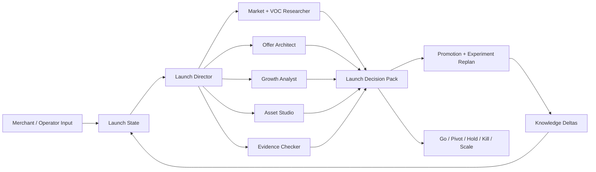

# OpenSKU

> Evidence-governed AI launch loop for ecommerce SKU decisions.

[](./backend/pyproject.toml)
[](./Makefile)
[](./frontend/package.json)
[](./LICENSE)

OpenSKU helps merchants, ecommerce operators, and indie sellers turn rough product ideas, listing URLs, competitor links, public signals, uploaded context, and post-test feedback into an evidence-backed SKU launch loop: **Go, Pivot, Hold, Kill, or Scale**.

No fake GMV. No fake CVR. No fake sales volume. Every recommendation is labeled as observed, uploaded, estimated, or unavailable.

## What It Does

OpenSKU is a vertical ecommerce agent workflow for adaptive SKU launch decisions before and during early launch. It supports idea-only concepts, supplier/sample review, pre-launch content tests, soft-launch feedback, and scale decisions.

Instead of producing a generic competitor report or a fixed "7-day plan", OpenSKU runs an adaptive launch loop:

- **Stage diagnosis**: whether the SKU is idea-only, sample/supplier stage, pre-launch test, soft launch, or scale/iterate.
- **Go / Pivot / Hold / Kill / Scale memo**: whether to continue, adjust, pause for missing data, stop, or expand.
- **Evidence ledger**: a JSON audit trail for public evidence, uploaded context, estimates, and unavailable data.
- **Competitor map**: visible price bands, claims, strengths, weaknesses, and source confidence.
- **SKU thesis**: target user, job to be done, offer promise, differentiators, risks, and kill assumptions.
- **Claim readiness matrix**: which copy claims are safe, which need product specs, test reports, or policy confirmation.
- **Promotion replanning**: how to adjust hooks, channel, price, page claims, creator brief, or test plan when new data arrives.
- **Adaptive experiment sprint**: a 3/7/14/30-day validation plan with decision rules for the next signal collection loop.
- **Knowledge deltas**: reusable category, channel, claim-risk, and experiment learnings captured from each run.

## Why It Matters

| Current workflow | OpenSKU workflow |
|---|---|
| Product ideas start as hunches in chat, spreadsheets, or founder intuition. | Ideas are converted into a structured launch decision with evidence IDs and missing-data labels. |
| Teams copy competitor claims without knowing whether they can safely use them. | Claims are classified as ready, draft-only, needs spec, needs test report, or do not use until verified. |
| AI tools often invent private metrics such as GMV, CVR, ROI, or sales volume. | Private metrics are marked unavailable unless the user uploads real data. |
| Launch plans become one-off docs that do not react to feedback. | Each run updates the launch state, promotion plan, next experiment, and reusable knowledge. |

## Architecture



OpenSKU is implemented as a product layer on an agent runtime with custom skills, custom subagents, file artifacts, and a dedicated ecommerce workspace UI.

## Core Modules

| Module | Responsibility | Evidence |
|---|---|---|
| `agents/ecom-launch/SOUL.md` | Lead-agent behavior, data boundary, modes, final response rules | Agent contract |
| `skills/custom/ecom-launch/SKILL.md` | Adaptive validate-launch workflow and artifact contracts | Skill spec |
| `skills/custom/content-calibration/` | Content scoring, prediction, retrospective, and rubric evolution | Skill directory |
| `evals/opensku/` | Benchmark cases, artifact validation, live-run scoring, expected-decision gates, release candidates | RC2 report |
| `scripts/opensku/` | Knowledge ingest, maturity promotion, and live evidence support scripts | Knowledge reports |
| `docs/knowledge/opensku/` | Source-linked execution memory generated from accepted live runs | Knowledge base |
| `docs/demo/` | Reviewer guide and final evidence matrix | Demo package |
| `frontend/src/components/workspace/ecom-launch/` | Launch Crew / War Room workspace visualization | React components |
| `backend/tests/test_ecom_launch_contract.py` | Contract checks for launch artifacts, stage decisions, and data boundaries | Backend test |
| `frontend/tests/unit/components/workspace/ecom-launch/` | War Room asset, motion, and UI model tests | Frontend tests |

## Agent Roles

| Agent | Role | Output |
|---|---|---|
| `market-voc-researcher` | Finds public market signals, competitor pages, reviews, and customer language | Competitor map and VOC findings |
| `offer-architect` | Turns evidence into audience wedge, job to be done, offer promise, and kill assumptions | SKU thesis and positioning |
| `growth-analyst` | Designs lightweight validation signals and interprets uploaded feedback when private metrics are unavailable | Experiment plan, promotion replan, and decision rules |
| `asset-studio` | Drafts listing copy, hooks, scripts, creator briefs, and comment replies | Listing and content packs |
| `evidence-checker` | Audits unsupported claims, unavailable metrics, and evidence confidence | Evidence ledger and claim readiness |

## Data Boundary

OpenSKU can use:

- public search results, public product pages, public reviews, articles, Q&A, and visible ecommerce SEO pages
- user-uploaded notes, screenshots, CSVs, exports, product specs, or policy documents
- clearly labeled estimates and assumptions

OpenSKU must not invent:

- GMV, CTR, CVR, ROI, ad spend, actual sales volume, refund rate, repeat purchase rate, exact market share, or verified uplift
- exact product specs, lab-test results, safety claims, certifications, warranty/refund policies, or testimonials without source evidence
- private platform coverage for Xiaohongshu, Douyin, Taobao, JD, PDD, Amazon, Shopify, or TikTok Shop without uploaded data

If data is unavailable, the workflow says so and proposes a test to collect it.

## Demo Scenario

Try OpenSKU with a rough ecommerce idea:

```text
我想做一款适合通勤女生的防漏便携咖啡杯，主要想在小红书和抖音种草。
我没有后台数据，也还没确定主卖点。
请帮我判断这个 SKU 当前处在哪个上新阶段，应该 Go、Pivot、Hold 还是 Kill，并生成下一轮测试和宣传调整方案。
```

Expected output:

```text
/mnt/user-data/outputs/
├── launch-war-room.html
├── evidence-ledger.json
├── competitor-table.csv
├── positioning-brief.md
├── listing-pack.md
├── content-pack.md
└── launch-calendar.csv
```

`launch-calendar.csv` is the default first sprint artifact. It may describe a 3, 7, 14, or 30-day loop depending on available data and launch stage; 7 days is only the demo default.

## Quick Start

### Requirements

- Python 3.12+
- Node.js 22+
- pnpm
- uv
- Optional: Docker for sandboxed execution

### Install And Run

```bash
git clone git@github.com:CheungkiCheung/OpenSKU.git
cd OpenSKU

make install
make config
make dev

open http://localhost:2026
```

If the repository is still under an older remote name, clone that remote and use the same local commands.

### Local Ecom Launch Demo

Manual demo materials live in [`docs/ecom-launch/`](./docs/ecom-launch/):

- [`demo-brief.portable-coffee-tumbler.json`](./docs/ecom-launch/demo-brief.portable-coffee-tumbler.json)
- [`manual-run-prompt.md`](./docs/ecom-launch/manual-run-prompt.md)
- [`subagents.ecom-launch.yaml`](./docs/ecom-launch/subagents.ecom-launch.yaml)

Reviewer package:

- [`docs/demo/opensku-reviewer-guide.md`](./docs/demo/opensku-reviewer-guide.md)
- [`docs/demo/opensku-final-evidence-matrix.md`](./docs/demo/opensku-final-evidence-matrix.md)
- [`evals/opensku/reports/2026-06-28-rc2-10run-decision-gate/summary.md`](./evals/opensku/reports/2026-06-28-rc2-10run-decision-gate/summary.md)
- [`docs/progress/2026-06-28-final-completion.md`](./docs/progress/2026-06-28-final-completion.md)

## Testing

Backend and eval checks:

```bash
cd backend
uv run pytest \
  tests/test_opensku_live_batch.py \
  tests/test_opensku_scoring.py \
  tests/test_opensku_release_candidate_gate.py \
  tests/test_opensku_live_runner.py \
  tests/test_opensku_cases.py \
  tests/test_opensku_artifact_writer_tool.py \
  tests/test_opensku_artifact_validator_tool.py \
  tests/test_opensku_artifact_validators.py \
  tests/test_opensku_benchmark_tool_policy.py \
  tests/test_opensku_knowledge_ingest.py \
  tests/test_opensku_knowledge_quality.py \
  tests/test_opensku_knowledge_context.py \
  tests/test_opensku_knowledge_promotion.py \
  tests/test_ecom_launch_contract.py \
  tests/test_tool_args_schema_no_pydantic_warning.py -q
```

Frontend War Room checks:

```bash
cd frontend
pnpm typecheck
pnpm test -- tests/unit/components/workspace/ecom-launch
pnpm test:e2e -- tests/e2e/artifact-preview.spec.ts tests/e2e/agent-chat.spec.ts
pnpm exec playwright test --config=playwright.real-backend.config.ts
```

Release-candidate gate:

```bash
uv run --project backend python evals/opensku/run_release_candidate_gate.py \
  --candidate-file evals/opensku/release_candidates/2026-06-28-rc2-10run.json \
  --report-name 2026-06-28-rc2-10run-decision-gate
```

## Project Structure

```text
OpenSKU/
├── agents/ecom-launch/                         # Lead agent contract
├── skills/custom/ecom-launch/                  # Validate-launch skill
├── skills/custom/content-calibration/          # Content calibration skill
├── evals/opensku/                              # Benchmark, scoring, reports, RC gates
├── scripts/opensku/                            # Knowledge ingest and promotion scripts
├── docs/knowledge/opensku/                     # Generated execution memory
├── docs/demo/                                  # Reviewer guide and evidence matrix
├── frontend/src/components/workspace/ecom-launch/
│   ├── war-room-page.tsx
│   ├── war-room-canvas-stage.tsx
│   ├── war-room-assets.ts
│   └── launch-crew-activity-model.ts
├── backend/tests/test_ecom_launch_contract.py
├── docs/ecom-launch/                           # Manual demo materials
└── docs/plans/ecom-launch-agent-spec.md        # Product and architecture spec
```

## Honest Status

| Capability | Status | Evidence |
|---|---|---|
| Validate-launch skill contract | Built | [`skills/custom/ecom-launch/SKILL.md`](./skills/custom/ecom-launch/SKILL.md) |
| EcomLaunch lead-agent behavior | Built | [`agents/ecom-launch/SOUL.md`](./agents/ecom-launch/SOUL.md) |
| Evidence-aware artifact set | Built | [`backend/tests/test_ecom_launch_contract.py`](./backend/tests/test_ecom_launch_contract.py), [`evals/opensku/validators/`](./evals/opensku/validators/) |
| 30-case OpenSKU benchmark | Built | [`evals/opensku/cases/`](./evals/opensku/cases/) |
| 10-run semantic release-candidate gate | Built | [`evals/opensku/reports/2026-06-28-rc2-10run-decision-gate/summary.md`](./evals/opensku/reports/2026-06-28-rc2-10run-decision-gate/summary.md), `PASS 530/530` |
| Real live agent validation evidence | Built | [`docs/progress/runs/`](./docs/progress/runs/) |
| Knowledge sedimentation and reuse | Built | [`docs/knowledge/opensku/README.md`](./docs/knowledge/opensku/README.md) |
| Launch Crew / War Room UI | Built | [`frontend/src/components/workspace/ecom-launch/`](./frontend/src/components/workspace/ecom-launch/) |
| UI screenshot evidence | Built | [`docs/progress/screenshots/2026-06-28-opensku-war-room.png`](./docs/progress/screenshots/2026-06-28-opensku-war-room.png) |
| Manual local demo path | Demo | [`docs/ecom-launch/README.md`](./docs/ecom-launch/README.md) |
| Real-backend UI replay | Lab | [`frontend/tests/e2e-real-backend/`](./frontend/tests/e2e-real-backend/) uses replayed model output, not a fresh live model call |
| Native JSON-driven dashboard from artifacts | Lab | Current workspace reads and displays structured artifact state; deeper dashboard analytics remain future work |
| Production ecommerce platform integrations | Planned | Requires real merchant API/data access |

## Design Decisions

| Decision | Why |
|---|---|
| Focus on adaptive SKU launch loops, not generic growth automation | A narrow ecommerce workflow is easier to trust, test, and explain. |
| Treat private metrics as unavailable by default | Most users do not have competitor GMV/CVR/ROI, and pretending otherwise destroys trust. |
| Keep War Room as a visualization layer | The professional deliverable is the evidence-backed launch loop; the UI makes agent progress inspectable. |
| Use public signals plus uploaded context | This supports realistic pre-launch work without claiming access to private platform dashboards. |
| Treat 7 days as a sprint default, not the product boundary | Real SKU launches adjust by stage, data quality, channel feedback, and operational constraints. |

## Roadmap

- [ ] Rename public repository metadata from the older growth-engine naming to OpenSKU.
- [x] Add JSON schemas and validators for core OpenSKU artifacts.
- [x] Add evals for forbidden metrics, unsupported claims, evidence IDs, unavailable-data labeling, and expected decisions.
- [x] Add `launch-state.json`, `promotion-replan.md`, and `knowledge-deltas.json` for adaptive launch loops.
- [x] Add benchmark cases for idea-only, sample, pre-launch, soft-launch, and scale-stage SKU workflows.
- [ ] Add more realistic demo cases for Amazon, TikTok Shop, Shopify, Xiaohongshu, and Douyin launch workflows.
- [ ] Add real merchant backend connectors for users who can provide authenticated exports or API access.
- [ ] Build richer analytics on top of the native artifact dashboard.

## License

MIT License. See [`LICENSE`](./LICENSE).
