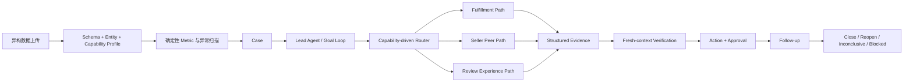

# Commerce Case Agent

> 工作名：面向电商运营的异构数据诊断与行动 Agent。

[](./backend/pyproject.toml)
[](./Makefile)
[](./frontend/package.json)
[](./LICENSE)

## 当前状态

项目正在从旧 OpenSKU / EcomLaunch 方案改造为 Commerce Case Agent。

Phase 0 与 Phase 1 已完成并提交。Phase 2 的确定性 Data Intake、Profiler、Semantic Rules、Capability、Normalized Facts、Metric、Anomaly、多卖家 Peer Cohort 与 Geographic Segment 主干已经完成；真实 DeepSeek V4 Preflight 也已实现，并在官方端点通过当次新请求验证，服务端返回身份为 `deepseek-v4-flash`。DeepSeek V4 语义候选层和持久化仍在实施。新 Agent 尚未完成，旧 OpenSKU 演示结果不得被当作新系统已经可用的证明。

完整设计与实施计划：

- [`docs/plans/2026-07-18-commerce-case-agent-complete-design-and-implementation-plan.md`](./docs/plans/2026-07-18-commerce-case-agent-complete-design-and-implementation-plan.md)

Phase 0 基线与迁移清单：

- [`docs/migration/commerce-case-agent-phase0-baseline.md`](./docs/migration/commerce-case-agent-phase0-baseline.md)

真实模型门禁记录：

- [`docs/progress/2026-07-18-commerce-real-deepseek-v4-preflight.md`](./docs/progress/2026-07-18-commerce-real-deepseek-v4-preflight.md)
- [`docs/progress/2026-07-18-commerce-phase2-peer-geographic-metrics.md`](./docs/progress/2026-07-18-commerce-phase2-peer-geographic-metrics.md)

## 解决什么问题

电商运营人员通常不是来要一份泛泛的“优化方案”，而是已经感觉经营出了问题：履约变慢、评分下降、低分评价上升、某类卖家表现异常，或者不同报表之间互相矛盾。

他们真正需要连续回答四个问题：

```text
哪里出了问题？
为什么发生？
现在最值得做什么？
做完以后有没有改善？
```

Commerce Case Agent 把一次对话升级为一个长期存在、可审计、可跟进的 `Case`：

```text
上传 CSV / Excel / 数据目录
→ 识别字段、实体、时间和可用能力
→ 确定性扫描异常
→ 创建 Case
→ 动态调查必要证据路径
→ 独立验证结论
→ 生成可审批 Action
→ 新数据到来后 Follow-up
→ Close / Reopen / Inconclusive / Blocked
```

## 用户如何使用

首要交互是上传真实数据，而不是要求用户先学会写复杂 Prompt。

用户可以：

- 拖入一个或多个 CSV / Excel 文件；
- 上传一个包含多张表的数据目录或压缩包；
- 说明“最近评分突然下降，帮我找到原因”；
- 让系统在新数据到来时重新检查已有 Case；
- 查看 Evidence、Hypothesis、Action、Approval 和 Follow-up；
- 在 Timeline、Graph 与 War Room 之间切换同一个真实 Run。

当上传数据缺少曝光、点击、加购、广告消耗、库存或利润时，系统不会假装拥有这些字段。它会完成当前数据允许的诊断，明确 `unknown`，并给出精确补数建议。

## 首批聚焦范围

首批只打穿三条证据路径：

| Path Agent | 关注问题 | 典型证据 |
|---|---|---|
| `FulfillmentPathAgent` | 延迟来自卖家处理还是承运运输 | 下单、批准、发货、送达、预计送达时间 |
| `SellerPeerPathAgent` | 某卖家或实体是否偏离同类基线 | 卖家、品类、区域、订单与评价聚合 |
| `ReviewExperiencePathAgent` | 评分下降是否与商品体验问题有关 | 评分、低分率、评论文本与时间窗口 |

系统按照数据 Capability 动态启动 0–3 个 Path Agent，不使用固定五 Agent Crew。

本轮不做：

- 万能电商经营平台；
- 模拟市场或虚构经营效果；
- 广告投放、库存、利润、定价、内容生成等全场景覆盖；
- 只输出报告、文案或“7 天方案”的一次性系统；
- 无人工门禁的高风险写操作；
- 线上 Agent 直接修改 Active Skill。

## 核心架构



### Harness 与业务边界

项目建立在 ByteDance DeerFlow 的开源 Harness 之上。

保留并复用的通用能力包括：

- LangGraph Runtime 与 RunManager；
- Streaming、Checkpoint、Sandbox 和 Tool 系统；
- Upload、Artifact、Auth、Memory 和 Skills 基础设施；
- Token Tracking、Loop Detection 和通用中间件。

个人新增主线位于应用层：

- `backend/app/commerce/`：Commerce Domain、数据、Metric、Case、Agent、Repository 与 API；
- Commerce Domain Event 与 Case 生命周期；
- Capability-driven Path Routing；
- Fresh-context Verification；
- Action / Approval / Follow-up；
- DeepSeek V4 真实模型评测 Harness；
- 受控 Skill Evolution；
- Codex-inspired Commerce Workspace。

依赖方向：

```text
app.* → deerflow.*
deerflow.* -X→ app.*
```

## 四条 Gold Case

系统首先用 Olist 公开电商数据构建四条可复现 Gold Case：

1. 履约异常：延迟与评分同时恶化，但卖家处理时长没有恶化，主要异常在承运运输阶段；必须反驳“卖家出库不足”。
2. 评价体验异常：延迟率为 0，但评分和低分率恶化，评论出现疑似非原装、错发、少发；不得确认售假或欺诈。
3. 能力缺失：删除 Review 数据后仍完成履约诊断，但不得声称评分下降；必须跳过 Review Path 并给出精确补数建议。
4. 卖家对标异常：目标卖家在同时间、同商品类目、同卖家州的结果无关 Cohort 中，延迟率为 `16/59 = 27.12%`；5 个 Peer 合计为 `19/257 = 7.39%`。差距支持继续调查，但不能直接证明卖家自身导致延迟。

完整公开数据不进入 Git。仓库只保存来源、Schema、构建脚本和经过审查的小型 Fixture。

当前四条 Fixture 位于 [`evals/commerce/cases/`](./evals/commerce/cases/)，构建与边界说明见 [`evals/commerce/README.md`](./evals/commerce/README.md)。

## Loop、Harness 与进化

每个调查 Loop 都必须具备：

- 明确 Goal；
- 可消费 Budget；
- 最小 ContextPacket；
- 结构化 Evidence；
- Checkpoint；
- Stop Condition；
- Verification；
- 可观察 Trace。

Skill 不在线自改。进化流程：

```text
Skill Candidate
→ Offline Eval
→ Regression
→ Holdout
→ Human Review
→ Shadow
→ Active / Rollback
```

## 真实 DeepSeek V4 测试政策

纯确定性测试保持无模型，例如 Domain、Metric、State Transition、Repository、Event、Budget、Policy 和数据质量。

任何触达 LLM 或验证 Agent 行为的测试，都必须向真实 DeepSeek V4 发起当次新请求，包括 Lead、Path Agent、Router 模型判断、Tool Selection、Verification、Semantic Evaluator、Skill Candidate、Agent Integration、Gold Case E2E、Experiment 和 Release Gate。

禁止用以下方式作为通过证据：

- Mock / Fake / Stub ChatModel；
- 录制回放或缓存响应；
- 其他 DeepSeek 版本；
- 其他厂商模型；
- 历史 Trace。

当前本地别名 `deepseek-reasoner` 不能单独证明服务端是 DeepSeek V4。Agent 测试前必须通过 `backend/app/commerce/evaluation/real_model_preflight.py`，确认实际模型身份并记录 Provider Request ID、Token、Latency、Retry 和配置版本。预检为每次请求注入唯一 nonce，显式关闭 LangChain 响应缓存与 SDK 自动重试，不保存 Prompt 或响应正文，只保存 nonce / 响应内容 SHA-256 与审计元数据；每次结果以不可覆盖 JSON 写入 `.deer-flow/commerce/evaluation/real-model-preflight/`。

如果模型不可用、身份无法确认、鉴权失败或额度不足，测试必须停止并报告 `blocked`，不能静默 Skip 或切换模型。

## Feature Flag

新系统默认关闭：

```bash
COMMERCE_CASE_AGENT_ENABLED=false
NEXT_PUBLIC_COMMERCE_CASE_AGENT_ENABLED=false
```

后端 Flag 控制 Commerce Router 是否挂载；前端 Flag 控制 Commerce Workspace 入口是否显示。两个 Flag 都开启后，新系统入口才完整可用。

旧 OpenSKU / EcomLaunch 不会自动接入新系统。

## 前端方向

前端采用 Case-first、Codex-inspired Workspace：

- Case Inbox；
- Dataset 与 Capability；
- Investigation Timeline；
- Evidence / Hypothesis；
- Action / Approval；
- Follow-up；
- Run Graph；
- War Room。

所有视图读取同一个 Domain Event Stream。War Room 不播放预设动画；没有真实事件时显示等待、空闲或阻塞。

每个正式页面，包括 War Room，都必须先生成高保真视觉稿并完成选择，再实现 React 页面。

## Legacy

以下目录只读保留，作为旧项目成果、历史评测和失败经验：

- `agents/ecom-launch/`；
- `skills/custom/ecom-launch/`；
- `evals/opensku/`；
- `scripts/opensku/`；
- `docs/ecom-launch/`；
- `docs/knowledge/opensku/`；
- `frontend/src/components/workspace/ecom-launch/`。

它们不是 Commerce Case Agent 的当前验收或 Release Gate。保护快照位于：

```text
archive/ecom-launch-pre-commerce-agent-20260718
9144237
```

## 开发

### 环境

- Python 3.12+
- Node.js 22+
- pnpm 10.26.2+
- uv
- 可选：Docker

### 启动 DeerFlow 基础设施

```bash
make install
make config
make dev
```

默认统一入口：

```text
http://localhost:2026
```

### 确定性验证

```bash
cd backend
PYTHONPATH=. uv run pytest tests/commerce \
  --ignore=tests/commerce/evaluation/test_real_model_preflight_live.py -v

cd ../frontend
pnpm typecheck
pnpm lint
```

### 真实模型验证

真实模型测试不会因为缺少密钥、额度或网络而静默跳过；预检会持久化明确的 `blocked_*` 状态并使测试失败。统一入口是：

```bash
cd backend
PYTHONPATH=. uv run pytest -m real_model tests/commerce -v
```

截至 2026-07-18，最终加固版预检已通过带唯一 nonce 的新鲜官方请求，返回 `deepseek-v4-flash`、72 Tokens、单次请求、零重试；此前两次独立官方请求也分别返回相同 V4 身份。该结果只证明真实模型门禁可用，不代表尚未实现的 Commerce Agent 行为已经通过。

## 归属声明

ByteDance DeerFlow 提供通用 Agent Harness 与全栈基础设施。本项目的面试重点不是把 DeerFlow 现有能力包装成原创，而是展示在其上完成的电商 Case 产品定义、业务 Domain、数据工程、Agent Loop、Context、Verification、Eval、受控进化和真实前端闭环。
