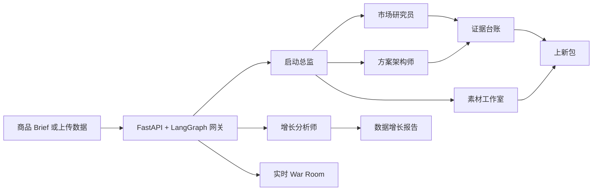

<p align="center">
  
</p>

<h1 align="center">OpenSKU</h1>

<p align="center"><strong>面向电商上新的开源 AI 团队。</strong></p>

<p align="center">
  把一个模糊商品想法，变成有证据边界的上新判断、商品方案<br />
  和可以直接编辑的发布素材。
</p>

<p align="center">
  <a href="README.md">English</a> ·
  <a href="#快速开始"><strong>快速开始</strong></a> ·
  <a href="#opensku-能交付什么">交付内容</a> ·
  <a href="docs/war-room.md">War Room</a>
</p>


OpenSKU 为独立开发者、产品团队和电商经营者提供一个协作式 AI 上新团队。它会在投入库存、广告预算和正式发布之前，研究公开市场信号，区分事实、估算和假设，设计商品方案，并在一个可追踪的流程中生成完整上新包。

## OpenSKU 能交付什么

| 你提供 | OpenSKU 调研 | 你获得 |
| --- | --- | --- |
| 粗略商品想法、公开链接或简短 Brief | 市场信号、竞品、价格、用户语言、风险和证据缺口 | 做 / 验证 / 停止建议，以及明确的置信度与下一步 |
| 可选 CSV 或 XLSX 数据 | 变化、异常、分群、留存和实验结果 | 基于上传数据的增长分析 |
| 品牌限制与目标渠道 | 定位、方案假设、商品页结构、内容钩子和脚本 | 可编辑的上新素材，而不是只停留在聊天回答 |

### 一个 Brief 输入 → 一套上新包输出

```text
商品 Brief
  ├─ 市场与用户声音研究
  ├─ 竞品与价格扫描
  ├─ 带证据边界的 Evidence Ledger
  ├─ 定位与商品方案假设
  ├─ 商品页文案与内容钩子
  └─ 7 天轻量验证计划
```

完整流程可生成：

```text
launch-war-room.html
evidence-ledger.json
competitor-table.csv
positioning-brief.md
listing-pack.md
content-pack.md
launch-calendar.csv
```

## 上新团队

| Agent | 职责 |
| --- | --- |
| **启动总监** | 拆解 Brief、调度专家并组装最终决策包。 |
| **市场研究员** | 查找竞品、价格信号、市场背景和真实用户语言。 |
| **方案架构师** | 设计定位、商品方案、定价和低成本验证假设。 |
| **素材工作室** | 把策略转成商品页文案、内容方向和发布脚本。 |
| **证据检查员** | 始终把公开事实、估算和待验证假设分开。 |
| **增长分析师** | 分析上传的 CSV/XLSX，发现变化、异常、分群和实验结果。 |

War Room 不是伪造状态的动画层。它展示每个 Agent 最新的真实线程、运行、任务、产物与失败状态。界面和 Phaser 场景都支持中英文实时切换。

## 三种使用方式

| 模式 | 适合场景 | 行为 |
| --- | --- | --- |
| **Flash** | 快速商品问题与早期类目扫描 | 单 Agent 直接调研和回答。 |
| **Ultra** | 完整上新前验证 | 启动总监调度专家并生成完整上新包。 |
| **Growth Analyst** | 店铺、投放或内容表现数据 | 使用上传的 CSV/XLSX 和确定性分析工具。 |

## 先讲证据，再讲结论

OpenSKU 使用三类证据标签：

- `observed_public`：有公开来源直接支持；
- `estimated`：基于可见证据计算或推断；
- `assumption`：仍需验证的明确假设。

这样可以避免一份看起来很完整的报告，悄悄把缺失数据变成虚构确定性。运行预算还会限制 LLM 调用次数、Token 和执行时间。

## 快速开始

### 环境要求

- Python 3.12+
- Node.js 22+
- [uv](https://docs.astral.sh/uv/)
- pnpm 10+
- nginx，或用于容器开发的 Docker Desktop

### 安装并启动

```bash
git clone https://github.com/CheungkiCheung/opensku.git
cd opensku
make quickstart
```

`make quickstart` 会打开交互式配置向导、安装前后端依赖并启动开发服务。启动完成后访问 [http://localhost:2026](http://localhost:2026)。

也可以分步执行：

```bash
make setup
make install
make dev
```

配置向导会生成本地配置文件，并提示添加至少一个支持的模型供应商 API Key。密钥、本地数据库和运行时数据都不应提交到 Git。

### Docker 开发

```bash
make docker-init
make docker-start
```

详细的本地开发、Docker、测试和故障排查方法见 [CONTRIBUTING.md](CONTRIBUTING.md)。

## 技术结构



## 开发与测试

```bash
# 后端
cd backend
make test
make lint

# 前端
cd frontend
pnpm typecheck
pnpm test
pnpm test:e2e
```

## Roadmap

- [x] 带证据边界的电商上新流程
- [x] 中英文产品界面
- [x] 实时多 Agent War Room
- [x] CSV/XLSX 增长分析师
- [ ] 可公开分享的上新报告
- [ ] 可复用类目和平台模板
- [ ] 可复现的上新质量评测
- [ ] 一键部署在线 Demo

## 参与贡献

欢迎提交 Issue、案例、设计反馈和 Pull Request。请先阅读 [CONTRIBUTING.md](CONTRIBUTING.md)，产品想法和实现问题可以在 [GitHub Discussions](https://github.com/CheungkiCheung/opensku/discussions) 交流。

## 许可证与第三方声明

OpenSKU 的原创贡献使用 [MIT License](LICENSE)。必须保留的上游版权与许可文本、第三方归属和兼容性说明统一放在 [THIRD_PARTY_NOTICES.md](THIRD_PARTY_NOTICES.md)。
