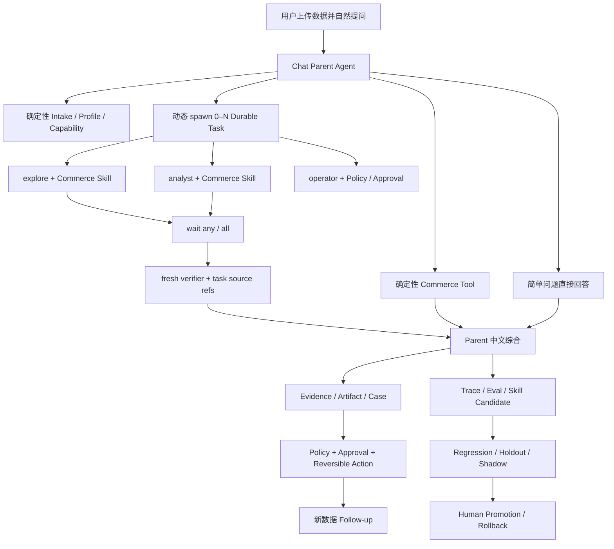

# Commerce Agent 中文求职材料包

> 目标岗位：AI Agent / Agent Platform / Applied LLM
> 目标公司：字节跳动及具有电商业务的大型互联网公司
> 当前主线：Chat-first Dynamic Parent–Subagent
> 上游基础：DeerFlow，底层执行引擎为 LangGraph
> 真实模型：服务端实际身份 `deepseek-v4-flash`，所有 Agent Gate `max_retries=0`
> 最新更新：2026-07-27，中文 Chat、真实 Task/Event 协作空间、原创 ImageGen 资产、持久化六文件浏览器 Gate、SQLite 重启恢复和 fresh DeepSeek V4 审计均已完成

## 1. 项目名称

推荐简历名称：

```text
Commerce Agent：基于 DeerFlow 的动态 Parent–Subagent 电商经营诊断与行动系统
```

更偏基础设施岗位：

```text
Durable Parent–Subagent Harness 与电商 Agent 闭环
```

更偏应用算法岗位：

```text
面向异构电商数据的可审计诊断与行动 Agent
```

不建议继续使用：

```text
电商文案生成系统
营销方案生成 Agent
万能电商智能体平台
```

## 2. 一句话定位

用户上传真实电商报表并自然提问，Parent Agent 根据数据能力动态调用确定性 Tool 和 0–N 个通用 Subagent，在 fresh-context Verifier 核验后给出可追溯中文结论，并通过审批、可逆 Action、Follow-up 和受治理 Skill Evolution 形成闭环。

## 3. 推荐简历项目描述

### 三条版，推荐

- 基于 DeerFlow 深度改造业务无关的 Durable Parent–Subagent Harness，实现动态委派、并行/后台任务、版本化 ContextPacket、`spawn/wait/follow-up/cancel/resume` 生命周期、Lease/Fencing 恢复及 Provider Request ID、模型身份、Token、Stop Reason 全链路审计。
- 构建 Chat-first 电商经营诊断主链，将异构 CSV/Excel/JSON/ZIP 接入、字段语义、Capability、窗口指标、同类对标和 Evidence 抽查封装为 11 个确定性 Tool，并以 `explore/analyst/verifier/operator + Commerce Skill` 代替固定业务 Crew；复用 DeerFlow Thread/Message/Composer 实现默认中文 Chat 和同源 Task/Event 游戏化协作空间。真实六文件持久化浏览器 Gate 完成 170,394 Token 的 Parent–Subagent Run，Explore/Analyst 并行、fresh Verifier 后置、13 个去重 Provider Request ID、retry 0，并在 Gateway 重启后恢复 Task/Event/Answer。
- 建立受治理 Skill Evolution 与可靠性门禁：Control/Candidate Experiment、Regression、Holdout、Shadow、Human Promotion、Rollback；真实四 Case Holdout 中 Candidate `8/8`，32 个唯一模型请求，并完成 PostgreSQL 迁移/连接重启/fencing takeover、双 Tool 预算和有界 Response Guard。

### 两条压缩版

- 基于 DeerFlow 构建 Chat-first 电商 Agent，扩展 Durable Parent–Subagent Harness，支持动态委派、并行任务、最小 Skill/Tool 权限包、fresh Verifier、双预算、恢复与全链路模型遥测；四条真实 DeepSeek V4 Gold Gate 全部通过。
- 将真实模型失败沉淀为版本化 Guard 和 Skill Evolution：Control/Candidate、Holdout、Shadow、Human Review/回滚；实现可追溯 Evidence、审批与可逆内部 Action，并通过 PostgreSQL 重启恢复和 fencing takeover 门禁。

### 一条极简版

- 基于 DeerFlow 深度改造 Durable Parent–Subagent Harness，构建可上传真实数据、动态调用 Tool/Skill、独立核验、审批执行和受治理自进化的 Chat-first 电商 Agent；使用 fresh DeepSeek V4 完成四 Gold Case、成本预算、失败恢复和 Skill Holdout/Shadow 验收。

## 4. 三十秒自我介绍

> 我基于字节开源的 DeerFlow 做了一个 Chat-first Commerce Agent。用户上传真实电商报表后，系统先用确定性 Tool 完成字段、Capability、指标和 Evidence 计算，Parent 再根据问题动态派遣 `explore`、`analyst` 或 fresh `verifier`，而不是固定跑一套 Crew。我重点改造了 Durable Parent–Subagent Harness，包括异步并行、Context 隔离、Tool 权限、双预算、Lease/Fencing 恢复和模型身份审计；同时做了受治理 Skill Evolution。四条真实 DeepSeek V4 Gold Gate 已全部通过，Candidate 的四 Case Holdout 是 `8/8`。

## 5. 两分钟自我介绍

> 我最初觉得项目只是生成一份电商运营方案，产品问题和 Agent 技术亮点都不够清晰。我重新定义了真实用户场景：运营人员已经感觉履约、评价或同类表现出了问题，他会上传手里的各种报表，然后连续追问哪里变了、可能为什么、下一步做什么、做完有没有改善。
>
> 数据层不让模型心算。上传 CSV、Excel、JSON 或 ZIP 后，服务端确定性完成 Profile、Semantic Mapping、Capability、Metric、窗口对比、同行 Cohort 和 Evidence。Parent Agent 可以直接回答、调用 Tool，或者动态启动 0–N 个通用 Subagent。业务专业性放在 Skill 里，Profile 只描述工作方式，所以新增退款、流量、广告或库存能力时不需要增加固定业务 Agent 类型。
>
> 我重点做的是 Harness：Durable Task Registry、版本化 ContextPacket、并行/等待/追问/取消/恢复、Tool 白名单、`max_tool_rounds + max_tool_calls` 双预算、Provider Request ID 和实际模型身份审计。Verifier 必须在首轮任务终态以后，用 fresh context 显式引用 `task:<id>` 独立重算。模型最终措辞偶发越界时，只有执行证据全部通过才允许一次无 Tool Response Guard，修复后还要重新过完整 Gate。
>
> Skill Evolution 不是运行中直接改 Prompt，而是从失败生成 Candidate，经 Security Scan、Control/Candidate、Regression、Holdout、Shadow、Human Review 后才能 Promotion，并支持回滚。当前四条跨场景 Chat Dynamic Gate 和真实六文件持久化浏览器 Gate 均通过；浏览器 Run 使用 170,394 Token、13 个去重 Provider Request ID、retry 0，服务端身份为 `deepseek-v4-flash`，并在 Gateway 重启后恢复三个 Task、104 条 Run Event、15 条消息和最终答案。独立 Chat Dynamic v7 仍保留一次受限 Response Guard 的真实审计。真实四 Case Holdout Candidate `8/8`，PostgreSQL 迁移和重启后 fencing takeover 也通过。前端已将同一 Durable Task Event 投影为中文 Chat 紧凑状态和按需游戏化协作空间。

## 6. 面试主线

建议按以下顺序讲，不要从页面数量或业务功能列表开始：

```text
真实用户问题
→ 为什么 Chat-first
→ 为什么动态 Parent–Subagent
→ Harness 隔离、预算、恢复与遥测
→ 确定性 Tool / Commerce Skill
→ fresh Verification 与答案安全
→ Skill Evolution
→ 真实 DeepSeek V4 调优证据
→ PostgreSQL / Connector / 浏览器边界
```

最值得强调的三项个人增量：

1. Durable Parent–Subagent Harness；
2. 受治理 Skill Evolution；
3. 真实模型调优与可复现 Release Gate。

Loop Engineering 不单独包装成名词，放在 Harness 内讲：

```text
Goal
Budget
Stop Condition
Checkpoint
Lease/Fencing
Wait/Resume
Cancel/Timeout
Replan
Response Guard
```

## 7. 当前动态架构



## 8. 为什么不是固定业务 Crew

固定 `履约 Agent / 评价 Agent / 同行 Agent` 会带来：

- 产品范围被 Agent 类型锁死；
- 每次都启动固定 Agent，成本不可控；
- 新业务能力需要改 Harness 拓扑；
- Profile、Skill 和 Tool 权限混在一起；
- 为展示多 Agent 而启动不相关角色。

当前设计：

```text
Profile = explore / analyst / verifier / operator
Skill   = fulfillment-investigation / seller-peer-analysis / ...
Tool    = 当前任务最小白名单
Budget  = 当前任务独立轮次、调用数、Token 和时间
```

同一个 `analyst` 可以加载履约 Skill，也可以加载同类对标 Skill；新增退款或广告诊断只新增 Skill/Tool，不新增固定 Crew。

## 9. Harness 技术亮点

### 9.1 Durable Task

```text
created
→ queued
→ running
→ waiting / waiting_approval / blocked
→ completed / failed / cancelled / timed_out
```

支持：

- Parent–Child lineage；
- append-only Task Event；
- optimistic revision；
- Lease/Fencing；
- `spawn_task`；
- `wait_task(any/all/one)`；
- `follow_up_task`；
- `cancel_task`；
- `resume_task`；
- 服务重启恢复；
- unknown external outcome reconciliation。

### 9.2 Context 隔离

每个 Subagent 获得版本化 ContextPacket：

```text
goal
source_refs
evidence_refs
constraints
available_skills
available_tools
budget
expected_output_schema
metadata
```

Verifier 不继承 Parent 的隐式推理历史，只能引用当前 Run 已终态的 `task:<id>` source snapshot。

### 9.3 双 Tool 预算

```text
max_tool_rounds：限制循环轮次
max_tool_calls：限制总调用数和单轮并行爆发
```

达到上限后卸载 Tool，并要求基于已有证据综合。Peer Analyst 的潜在 5 次调用被稳定压到 4 次。

### 9.4 Wait 恢复安全

Parent 拼错一个 Task ID 时：

- 不做模糊匹配；
- 正确 Task 仍可返回；
- unknown 路径只给出当前 user/thread/run 的授权恢复清单；
- 真实跨 Run Task ID 继续 fail closed；
- 正常 wait 不重复输出所有 Task 快照。

### 9.5 可观测性

每次真实模型调用审计：

```text
configured alias
actual model identity
Provider Request ID
input/output/total tokens
stop reason
retry count
prompt/context/router/skill version
```

Key、原始 reasoning 和用户明文答案不进入公开审计。

## 10. 真实模型调优案例

### 案例一：同一轮 Tool 爆发

```text
只有 max_tool_rounds
→ 模型同一轮并行调用过多 Tool
→ 增加 max_tool_calls
→ 响应超过剩余额度时确定性截断
→ 下一轮卸载 Tool 并综合
```

### 案例二：Tool 输出挤占上下文

```text
无 read_file 仍请求完整 Profile
→ 22k–29k 输出被截断
→ Executor 注入 available_tool_names
→ reader 不可用时直接返回 compact Profile
```

### 案例三：指标语义混淆

```text
Compare 默认返回全部指标
→ 模型把 low_rating_rate 写成 late_delivery_rate
→ Skill 强制最小 metric_names
→ Tool 输出稳定小于 12k 字符
```

### 案例四：最终答案先夸大、后自我否定

```text
“显著高于同行”
后文又写“未做统计检验，不能认为显著”
→ deterministic Gate 正确拒绝
→ 仅 answer-only issue 允许一次 fresh 无 Tool Response Guard
→ 修复请求计入 Parent Token/Request 审计
→ 修复后重新执行完整 Gate
```

### 案例五：Semantic Evaluator 自修订文本过长

```text
合法 JSON
但 explanation > 1500
→ Holdout fail closed
→ Prompt 限制 ≤ 300 字符并禁止 revision commentary
→ 超长自由文本丢弃，结构化布尔判定保留
→ 四 Case Holdout 重新通过
```

## 11. 真实证据表

| 门禁 | 当前证据 |
|---|---|
| Chat Dynamic Gold | `4 passed in 253.05s` |
| 最新 Chat Dynamic v7 | `2 passed in 70.58s`，17 请求，199,598 Token |
| 持久化 Chat 浏览器 v7 | 六文件真实上传，170,394 Token，13 unique Request ID，retry 0 |
| 浏览器任务拓扑 | Explore/Analyst 并行，fresh Verifier 后置，3 Task completed |
| 重启恢复 | 3 Task、104 Run Event、15 Message、最终答案恢复 |
| 实际模型身份 | `deepseek-v4-flash` |
| Provider retry | `0` |
| v7 Parent Tool Error | `0` |
| v7 Response Guard | 1 次受限改写，计费并重新执行完整 Gate |
| Harness/Dynamic/Tool 回归 | 452 passed |
| Skill Holdout | Candidate `8/8`、32 unique requests |
| Skill Shadow | 两个真实隔离 Run 通过 |
| PostgreSQL | 全迁移、连接重建、Checkpoint 恢复、fencing `1 → 2` |
| 前端单元 | 62 files / 334 tests |
| Commerce Chat/协作空间 E2E | 6 Chromium Playwright passed |
| 原创协作空间 | 空场景 + 4 Profile 角色 + 4 类工位，真实 Task/Event 驱动 |
| Next.js production build | Next.js 16.2.6，79/79 静态页面生成 |

这些指标是工程门禁，不是业务 uplift，不应写成 GMV、转化率或利润提升。

## 12. DeerFlow 上游与个人新增边界

### 复用 DeerFlow

- LangGraph 底层执行；
- Thread、Message、Streaming；
- Agent factory；
- Tool / Skill / Sandbox 基础；
- 模型 factory；
- 原始 SubagentExecutor；
- DeerFlow Chat 前端。

### 个人新增

- Durable SubagentTask、ContextPacket、Event、Lease/Fencing；
- 原生 `spawn/wait/follow-up/cancel/resume`；
- Tool round/call 双预算；
- Dynamic Commerce Tool / Skill 主链；
- fresh Verifier source snapshot；
- unknown Task 恢复与跨 Run fail closed；
- Response Guard；
- Commerce 数据、Metric、Evidence、Action、Follow-up Domain；
- Experiment/Holdout/Shadow/Human Promotion/回滚治理；
- PostgreSQL 重启恢复门禁；
- Task Event → Chat/游戏场景共享 ViewModel。

## 13. 框架选型回答

### 为什么不是 raw LangGraph

DeerFlow 已经以 LangGraph 为底层，具备模型、Tool、Skill、Sandbox、Streaming 和 Subagent 基础。重新写一套 Graph 会重复基础设施，但仍然解决不了 Durable Task、业务 Evidence、Action 和 Skill Governance。

### 为什么不是 DeepAgents / Pi Agent

它们适合 greenfield 或更小的通用循环。本项目在 DeerFlow 仓库内深度改造，迁移会丢失已有全栈、Sandbox 和 Subagent 基础，同时 Durable 生命周期、业务状态和评测仍需要自己实现。

### 为什么不是固定 LangGraph 状态机

固定图适合稳定业务流程，但用户问题和数据能力并不固定。当前架构让 Parent 动态选择 Tool、Skill 和 Subagent；真正需要确定性的部分放在 Harness 状态机、权限、预算和业务 Domain 中。

## 14. 高频面试问答

### Q1：这是不是套壳 DeerFlow？

不是。DeerFlow 提供基础 Harness，本项目新增的是 Durable Task 生命周期、动态 Context/Skill/Tool 权限包、双预算、fresh Verification、Commerce Domain、Skill Evolution 和真实 Release Gate。面试时应主动展示上游/个人边界表。

### Q2：为什么需要 Subagent？

不是因为“多 Agent 看起来更高级”，而是为了隔离上下文、权限、预算和失败域，并让关键结论能由 fresh context 独立核验。简单问题可以 0 Subagent 直接回答。

### Q3：怎么证明是动态而不是固定工作流？

Parent 可以直接回答、只调用 Tool、启动一个或多个同类型任务、并行首轮任务、终态后再启动 Verifier；Profile 与 Skill 分离，没有固定业务 Crew。Release Gate 检查实际 `spawn_task` 参数和生命周期，而不是从文案推断。

### Q4：为什么指标不用模型算？

订单数、晚到率、评分、窗口和 Cohort 都是可重复计算的确定性问题。模型负责选择调查角度、解释证据和提出有边界的下一步，不能心算业务指标。

### Q5：怎么防止 Subagent 越权？

ContextPacket 冻结 Skill、Tool 白名单和预算；Executor 和 Middleware 在运行时再次过滤。Release Gate 对实际调用 Tool 与授权包做集合检查，Operator 还需要 Policy 和 Approval。

### Q6：为什么需要 fresh Verifier？

如果验证者继承 Parent 的完整推理历史，容易重复原结论。Verifier 只看当前 Run 的终态 Task snapshot 和确定性 Tool，独立重算关键事实与反证。

### Q7：模型调用失败或进程崩溃怎么办？

Task/Run 有 Checkpoint、Lease 和 fencing token。远端结果无法确认时不盲重试，而是标记 unknown external outcome，结束旧 Run；显式重试创建新的 Replan Run，成本与责任独立。

### Q8：Response Guard 会不会掩盖错误？

不会。只有所有 issue 都属于最终答案时才允许一次改写；任何 Task、Tool、Verifier、模型身份、并行生命周期或预算问题都不能修。改写调用也必须是 fresh V4，并重新进入完整 Gate。

### Q9：自进化是不是让 Agent 自己改线上 Prompt？

不是。运行 Trace 只能生成不可变 Candidate。Candidate 要经过 Security Scan、Regression、Holdout、Shadow 和 Human Review，只有 Promotion Service 能更新 Active Pointer，并保留回滚证据。

### Q10：没有真实公司数据，项目可信吗？

使用真实公开 Olist 记录和用户上传合同可以证明数据接入、指标、Agent 行为、Evidence 和恢复语义，但不能证明私有业务 uplift。项目明确不虚构 GMV、CTR、ROI、库存和利润。

### Q11：为什么 Token 这么高？

当前 Gold Gate 是面试级全审计验收，包含 Parent、多轮 Tool schema、两个首轮 Task、fresh Verifier 和完整遥测，目标是冻结可靠性基线。项目已通过 compact Profile、最小 metric_names、Fact 预览和 Tool call budget 降低上下文；下一阶段应对 Prompt 与 Tool schema 做 Pareto 优化，不把当前成本包装成生产最优。

### Q12：PostgreSQL 验证了什么？

验证了全迁移、真实写入、连接/进程边界后的 Run/Checkpoint 恢复和 Lease fencing takeover；没有声称已经完成生产多节点 HA 或性能压测。

## 15. 八分钟 Demo 顺序

```text
0:00–0:40  中文 Chat 上传与问题
0:40–1:20  Capability 与确定性 Tool
1:20–2:40  Explore / Analyst 并行
2:40–3:30  wait-all + fresh Verifier
3:30–4:20  中文答案、Evidence、反证与限制
4:20–5:10  协作空间 Task → 角色 → 工位
5:10–6:00  Request ID / Token / retry / Stop Reason
6:00–6:50  v7 failure → 根因 → TDD → PASS
6:50–7:30  Skill Candidate Holdout / Shadow
7:30–8:00  上游边界和诚实限制
```

短面试不建议现场跑四 Case 真实模型 Gate；展示不可变审计，同时现场跑一个较短 Preflight 或 Response Guard smoke。

## 16. 诚实边界

当前不能声称：

- 外部商家平台写入已完成；
- 当前 Shadow Candidate 已经 Promotion；
- 公开数据证明了业务 uplift；
- PostgreSQL 已完成生产多节点 HA/压测。
- 最新 v7 是 repair-free；它真实使用了一次受限 Response Guard。
- Subagent 内部每个 LangGraph 节点都具备 exactly-once 恢复；当前是 Durable Task 级恢复。

当前可以声称：

- 动态 Parent–Subagent 后端主链和四 Gold Gate 已通过；
- 最新 Chat Dynamic Gate v7 已通过并保留失败→根因→TDD 修复→PASS 审计；
- 所有 Agent/LLM Gate 使用 fresh DeepSeek V4；
- 真实 DeepSeek V4 持久化浏览器 Agent Gate 已通过，且同一 Run 可在不再次调用模型的情况下续审；
- Durable Task、双预算、fresh Verifier 和 Response Guard 可审计；
- Skill Holdout/Shadow 已真实运行；
- 内部 Connector 可执行、读回和回滚；
- PostgreSQL 迁移、重启恢复和 fencing takeover 已通过；
- 中文 Chat 主入口、Task Event API、Reducer、ViewModel、增量 Hook 和按需协作空间已完成；
- 原创 ImageGen 角色、场景和工位已进入运行时，角色、状态和 Tool 标签只由真实 Task/Event 产生；
- Gateway 使用 SQLite Checkpointer/Store/DB Run Event，已证明重启后同一 Thread/Run/Task/Event/Answer 可恢复；
- 当前剩余项是主动保留的生产边界：外部 Connector、Candidate 人审 Promotion、正式多租户权限和容量压测。

## 17. 代码与证据入口

| 主题 | 入口 |
|---|---|
| 总计划 | `docs/plans/2026-07-24-commerce-chat-subagent-harness-plan.md` |
| Durable Harness | `backend/packages/harness/deerflow/subagents/tasks/` |
| Durable Tools | `backend/packages/harness/deerflow/tools/builtins/durable_task_tools.py` |
| Tool 双预算 | `backend/packages/harness/deerflow/agents/middlewares/subagent_tool_budget_middleware.py` |
| Commerce Tool | `backend/app/commerce/tools/` |
| Dynamic Release | `backend/app/commerce/evaluation/chat_dynamic_release.py` |
| Skill Evolution | `backend/app/commerce/evaluation/skill_evolution.py` |
| PostgreSQL Gate | `backend/tests/commerce/persistence/test_postgres_integration.py` |
| Chat Event ViewModel | `frontend/src/core/commerce/run-task-activity-view-model.ts` |
| Collaboration Scene ViewModel | `frontend/src/core/commerce/collaboration-scene-view-model.ts` |
| Chat 增量 Hook | `frontend/src/components/commerce/use-commerce-run-task-activity.ts` |
| ImageGen 运行时资产 | `docs/design/commerce-collaboration-imagegen-assets-v1.md` |
| Dynamic 调优记录 | `docs/progress/2026-07-26-commerce-dynamic-release-hardening.md` |
| Chat Dynamic Gate v7 | `docs/progress/runs/2026-07-27-commerce-chat-subagent-gate-v7/README.md` |
| PostgreSQL/Skill 记录 | `docs/progress/2026-07-26-commerce-postgres-skill-evolution-release.md` |
| 中文 DOCX 简历 | `/Users/zhangqixiang/0_3秋招/秋招公司项目/张祺翔_AI_Agent应用开发_简历_Commerce_Agent版_20260727.docx` |
| 中文 PDF 简历 | `/Users/zhangqixiang/0_3秋招/秋招公司项目/张祺翔_AI_Agent应用开发_简历_Commerce_Agent版_20260727.pdf` |
| DOCX/PDF 验证记录 | `docs/progress/2026-07-27-commerce-agent-resume-docx.md` |
