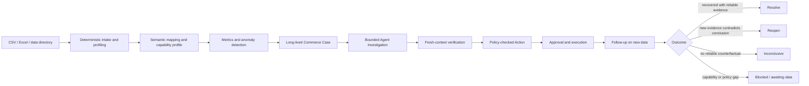
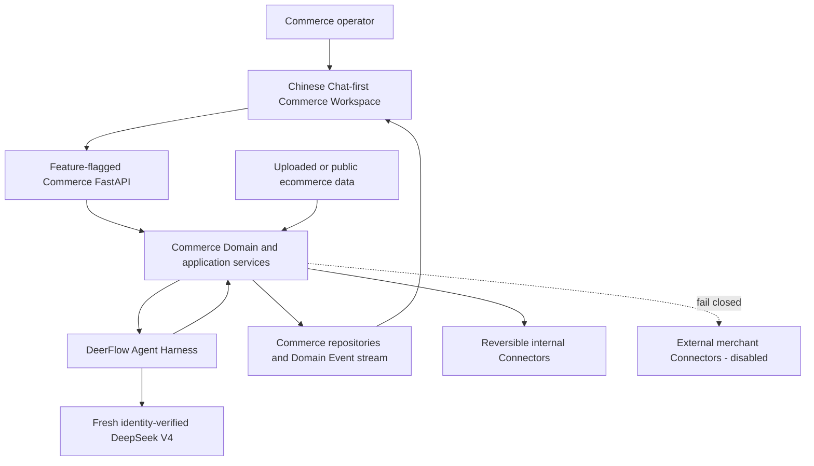
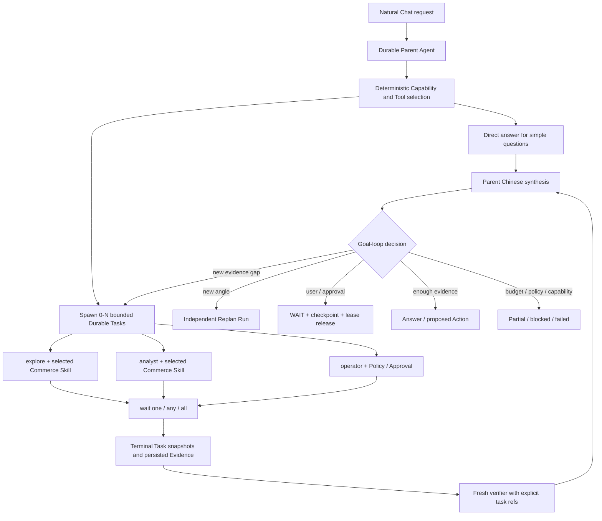
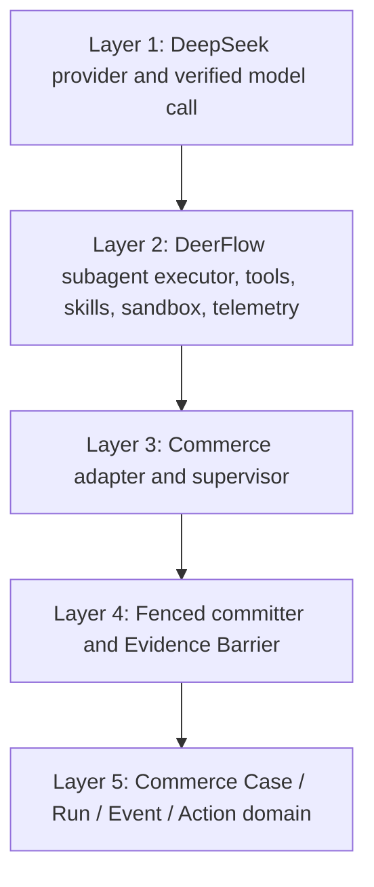
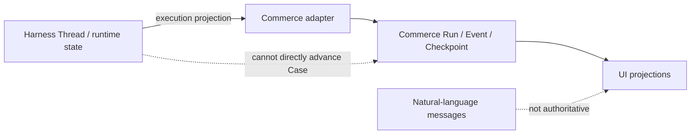
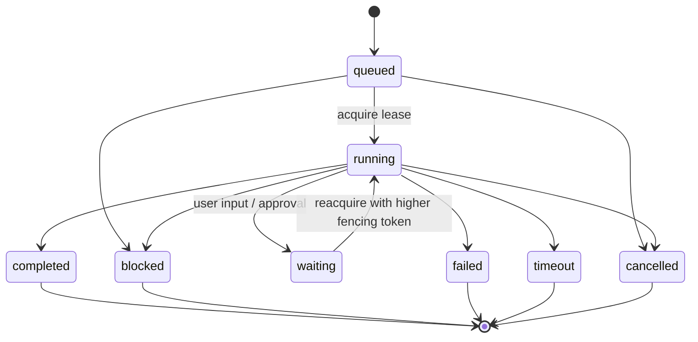
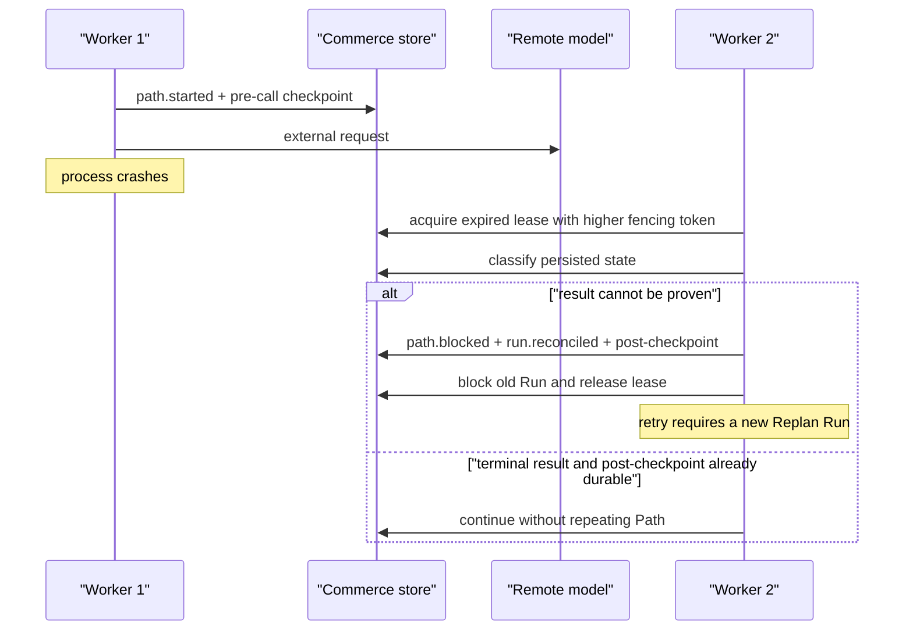
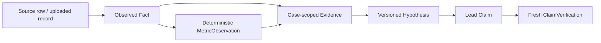
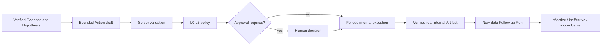

# Commerce Case Agent Architecture

> 当前主线已经重定向为 Chat-first Dynamic Parent–Subagent。本文中固定 Path / Case-first 段落仅用于说明历史实现和迁移对照；当前面试主讲架构与证据见 `docs/portfolio/commerce-agent-job-package-2026-07-26.md`。

> Audience: AI Agent / Agent Infrastructure interviewers  
> Product scope: ecommerce operations diagnosis and action follow-up  
> Runtime: DeerFlow Harness with bounded Commerce subagents  
> Business source of truth: Commerce Case / Run / Event / Checkpoint / Lease

## 1. One-Sentence Positioning

Commerce Agent starts from a natural Chat and uploaded heterogeneous ecommerce data. A Parent Agent dynamically chooses deterministic Tools and 0–N bounded Subagents, independently verifies critical conclusions, and upgrades complex work into evidence-traceable Cases, approved Actions, Follow-up and governed Skill evolution.

It is not a copywriting Agent and not a market simulator.

## 2. Product Loop



The product answers four consecutive questions:

1. What changed?
2. Why might it have changed?
3. What bounded Action is worth doing now?
4. Did the signal improve after the Action?

## 3. System Context



The implemented UI does not infer state from chat messages. Chinese Chat, compact task activity, the on-demand collaboration space, Evidence, Action and Follow-up all read structured Domain Events and projections.

## 4. Runtime Topology



### Why bounded subagents

- Each Task receives a minimal versioned `ContextPacket`.
- Each Task has an explicit Tool allowlist, Skill version, model assignment and budget.
- Profiles describe generic working styles: `explore`, `analyst`, `verifier`, `operator`.
- Business expertise is loaded dynamically as a Commerce Skill instead of encoded as a fixed business Agent type.
- A Task cannot write Commerce state directly; the application validates and commits its structured result.
- Zero to N bounded Tasks are selected. The system does not launch a fixed business crew on every question.
- Independent Tasks run concurrently; a fresh verifier starts only after required source Tasks have terminal persisted snapshots.

## 5. Harness Layers



### Layer 1: verified model boundary

- official endpoint: `https://api.deepseek.com/v1`;
- configured alias: `deepseek-reasoner`;
- accepted server identity: `deepseek-v4...`, currently `deepseek-v4-flash`;
- response cache disabled;
- provider retries set to `0`;
- unique nonce per real-model gate;
- Provider Request ID, actual model identity, token usage, latency, retry and stop reason persisted;
- sync and async provider clients closed explicitly.

### Layer 2: DeerFlow Harness

Reused upstream capabilities:

- LangGraph-based Agent loop;
- subagent execution;
- Tool and Skill infrastructure;
- sandbox and permission middleware;
- streaming and checkpoint integration;
- model factory and telemetry;
- cancellation and bounded shutdown.

### Layer 3: Commerce adapter and supervisor

Personal project additions:

- stable Commerce `AgentTaskId` ↔ DeerFlow task binding;
- minimal prompt and Context construction;
- allowed Tool injection only;
- runtime telemetry extraction from trusted runtime objects;
- structured output parsing and repair;
- task status mapping into Commerce outcomes;
- cancellation, timeout and lifecycle cleanup.

### Layer 4: fenced persistence

- only the current lease owner may write;
- only the lease-token SHA-256 is persisted;
- expired takeover increments a fencing token;
- stale Workers cannot heartbeat or append Checkpoints;
- accepted Evidence enters the Case through a dedicated committer;
- terminal Path Event and post-call Checkpoint commit atomically;
- the Evidence Barrier releases only persisted Evidence.

### Layer 5: Commerce domain

- Dataset and Capability;
- Case and CaseLineage;
- Evidence and versioned Hypothesis;
- Run, Checkpoint, Lease and Domain Event;
- Action, Approval, Artifact, Rollback and Follow-up;
- Eval, Experiment, Skill Candidate, Shadow and Active Pointer.

## 6. State Ownership



The central architectural rule is:

```text
Commerce Run/Event/Checkpoint is business truth.
DeerFlow Thread/Run is execution projection.
```

This avoids putting ecommerce concepts into the reusable Harness while still reusing its execution infrastructure.

## 7. Commerce Run State Machine



Terminal Runs are immutable. A verification rejection, tool-failure retry or unknown remote outcome retry creates an independent Replan Run instead of resurrecting the parent.

## 8. Restart and Unknown-Outcome Semantics

Exactly-once model execution cannot be guaranteed across a remote API boundary. The system manages this explicitly:



Supported restart dispositions include:

- initial call allowed;
- await explicit retry decision;
- reconcile partial Evidence;
- continue after completed Path;
- continue after blocked/failed Path;
- wait for user input;
- wait for approval;
- continue after verified fencing resume;
- invalid state.

Only the no-Checkpoint initial state automatically permits an external model call.

## 9. Deterministic Data Plane vs Agent Plane

| Deterministic server-owned work | Agent work |
| --- | --- |
| file safety and profiling | semantic explanation |
| schema and mapping confirmation | bounded semantic mapping candidate |
| entity joins and normalized Facts | Path investigation over visible context |
| metric windows and anomaly calculation | Tool selection inside an allowlist |
| peer cohort eligibility | synthesis of persisted Evidence |
| Capability availability | fresh verdict over claims |
| policy, risk and approval level | choosing one fixed internal Action kind |
| stable IDs, hashes and lineage | proposing calibrated hypotheses |

The model never computes authoritative GMV, CVR, ROI, profit, inventory, metric windows, cohort membership, risk level or approval policy.

## 10. Evidence Model



Rules:

- Fact, Metric, Evidence, Hypothesis and Claim are different objects.
- Every accepted Claim references its original supporting Evidence.
- Metric Claims end with Metric lineage.
- Fact/VOC Claims may be Fact-backed without a fake Metric.
- IDs outside the fresh Context fail closed.
- Review text may support suspected wrong/missing items, but cannot confirm fraud or illegality.
- Correlation is not written as causation.

## 11. Goal Loop

One loop iteration has:

```text
Goal
→ persisted observation
→ route or answer decision
→ bounded work
→ durable Checkpoint
→ progress evaluation
→ continue / replan / wait / stop
```

Stop conditions:

- goal achieved;
- partial goal achieved with no viable next step;
- awaiting user input;
- awaiting approval;
- capability blocked;
- policy blocked;
- verification requires replan;
- tool failure;
- budget exceeded;
- repeated no-new-Evidence threshold;
- cancellation.

This is a real loop because new Evidence changes the next route and because the Agent can wait, resume, replan and terminate from persisted state. It is not a fixed chain that always runs every role.

## 12. Action and Follow-Up Loop



Current executable Connectors are internal and reversible. External merchant writes remain disabled and fail closed.

Without a reliable counterfactual, Follow-up returns `inconclusive`; it does not claim the Action caused a metric change.

## 13. Skill Evolution

```mermaid
flowchart LR
    Failures["Versioned failure codes"] --> Candidate["Immutable Skill Candidate"]
    Candidate --> Security["Security scan"]
    Security --> Offline["Offline experiment"]
    Offline --> Regression["Regression and holdout"]
    Regression --> Shadow["Two or more fresh live Shadow Runs"]
    Shadow --> Review["Human review"]
    Review --> Active["Active Pointer"]
    Active --> Monitor["Post-promotion monitoring"]
    Monitor -->|"regression"| Rollback["Human rollback to base version"]
```



The online Agent never edits the Active Skill. It can only propose an immutable Candidate.

The current real Candidate is still `shadow`. APIs and rollback recovery are implemented, but no actual Active Pointer change occurs without explicit user authorization.

## 14. Evaluation and Tuning Story

The project uses three layers of acceptance:

1. deterministic contracts for data, state, lineage, budgets, policy and failure paths;
2. fresh DeepSeek V4 behavior gates for every Agent/model path;
3. Gold Case release gates with semantic and trace evaluation.

The four-Gold full investigation gate used:

- four public Olist-derived cases;
- exact expected Path parity;
- 14 unique Agent Provider Request IDs;
- 71,478 total Agent tokens;
- retry `0` for every request;
- actual identity `deepseek-v4-flash`;
- 94.19 seconds pytest wall time;
- completed Runs and released Leases.

The accepted v11 followed ten retained real failures, including schema failures, malformed JSON, missing Evidence lineage, output truncation, opaque-ID hallucination, explicit-case anomaly assumptions and provider-client lifecycle errors.

## 15. Technology Choice

| Option | Decision | Reason |
| --- | --- | --- |
| DeerFlow Harness | selected | already provides subagents, tools, skills, streaming, sandbox, model configuration and LangGraph runtime |
| raw LangGraph | not primary | would duplicate the existing Harness and still require a Commerce domain |
| DeepAgents | not migrated | reasonable greenfield choice, but duplicates existing filesystem/planning/subagent capabilities |
| Pi Agent | not selected | minimal loop would require rebuilding durability, streaming, policy and observability |
| Multica | not selected | oriented toward coding-agent squads and issue workflows, not ecommerce evidence/action state |
| bespoke role-specific workers | migration baseline only | would repeat prepare/call/checkpoint/heartbeat/accounting/persistence logic for every role |

## 16. Upstream vs Personal Contribution

### ByteDance DeerFlow upstream foundation

- LangGraph-based Agent Harness;
- general subagent runtime;
- sandbox, Tool and Skill infrastructure;
- streaming and generic runtime services;
- model factory and middleware;
- base frontend and workspace infrastructure.

### Personal project additions

- ecommerce Case-first product definition;
- heterogeneous data and Capability system;
- deterministic metrics, anomalies and peer cohorts;
- Commerce Domain and independent persistence/migrations;
- bounded Commerce subagent contracts and adapter;
- Evidence Barrier and fresh Verification;
- Run/Checkpoint/Lease/Fencing and restart reconciliation;
- Action/Approval/Execution/Rollback/Follow-up;
- real-model preflight, Gold Cases, experiments and release gates;
- Skill Candidate/Shadow/Promotion governance;
- Chinese DeerFlow Chat, compact Task activity and an on-demand React collaboration space driven by the same Durable Task/Event ViewModel;
- original ImageGen room, profile actors and task stations with empty-Run, desktop, 390px and reduced-motion contracts.

## 17. Current Evidence

```text
Commerce deterministic: 427 passed, 23 real-model tests deselected
Security / fault focused gate: 215 passed
Harness sandbox / lazy-import regression: 204 passed
Final Harness/Commerce targeted regression: 452 passed
Four-Gold full Agent Investigation: 1 passed in 94.19s
Latest Dynamic v7: 2 passed in 70.58s, 17 requests, 199,598 tokens
Persistent browser v7: six uploads, 170,394 tokens, 13 unique request IDs, retry 0
Persistent topology: Explore/Analyst parallel, fresh Verifier, 3 tasks completed
Restart recovery: 3 tasks, 104 run events, 15 messages and final answer
Frontend: 62 test files / 334 tests, Prettier/ESLint/TypeScript PASS
Commerce Chat/collaboration Playwright: 6 passed
Next.js 16.2.6 production build: PASS, 79/79 static pages
Actual model identity: deepseek-v4-flash
Provider retry: 0
```

## 18. Honest Remaining Boundaries

- Chinese Chat, real six-file upload, persistent Parent–Subagent Run, Task/Event collaboration space and desktop/mobile browser QA are complete;
- SQLite Checkpointer/Store/DB Run Events recover the same Thread/Run/Task/Event/Answer after Gateway restart;
- live local PostgreSQL migration/restart/fencing is accepted; production multi-node load testing remains out of scope;
- external merchant Connectors are disabled;
- authenticated Workspace membership is not integrated;
- the real Shadow Skill Candidate is not promoted;
- production multi-node file-receipt storage should move to transactional CAS storage;
- production multi-tenant performance and multi-node persistence cannot be claimed from the current local release gates.

These are explicit release boundaries, not hidden implementation details.

## 19. Code Map

| Concern | Location |
| --- | --- |
| Commerce Domain | `backend/app/commerce/domain/` |
| deterministic data | `backend/app/commerce/data/`, `backend/app/commerce/metrics/` |
| Agent contracts and loop | `backend/app/commerce/agents/` |
| Action lifecycle | `backend/app/commerce/actions/` |
| application API | `backend/app/commerce/api/` |
| persistence | `backend/app/commerce/persistence/` |
| evaluation and Skill evolution | `backend/app/commerce/evaluation/` |
| reusable Harness | `backend/packages/harness/deerflow/` |
| Gold Cases | `evals/commerce/cases/` |
| accepted live evidence | `docs/progress/2026-07-20-commerce-four-gold-agent-release.md` |
| latest Chat Dynamic v7 | `docs/progress/runs/2026-07-27-commerce-chat-subagent-gate-v7/README.md` |
| persistent Chat browser v7 | `docs/progress/runs/2026-07-27-commerce-chat-browser-gate-v7/` |
| collaboration assets and provenance | `docs/design/commerce-collaboration-imagegen-assets-v1.md` |
| frontend Chat/collaboration E2E | `frontend/tests/e2e/commerce-agent-chat-collaboration.spec.ts` |
| backend governance audit | `docs/progress/2026-07-20-commerce-governance-resume-release-audit.md` |

## 20. Related Decisions

- `docs/adr/0004-commerce-run-is-domain-source-of-truth.md`
- `docs/adr/0005-commerce-uses-deerflow-subagent-runtime.md`
- `docs/plans/2026-07-18-commerce-case-agent-complete-design-and-implementation-plan.md`
